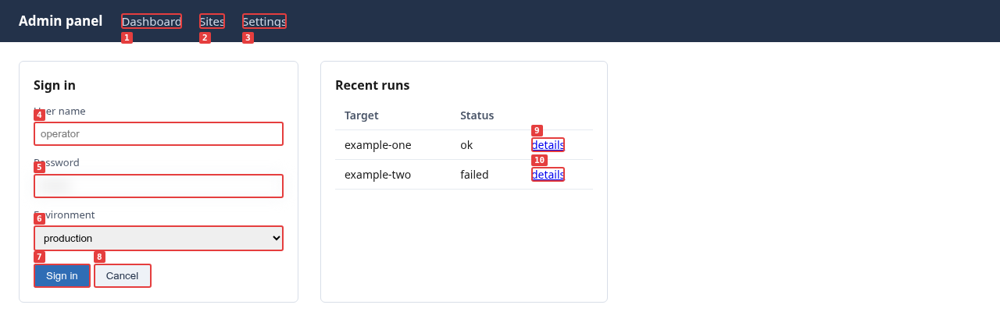

# Diwall — Shared Visual Reference between Human and LLM

> **For the human operator:** Diwall lets you delegate visual verification to your LLM. Both of you see the same capture — you stop having to take its word for it.
>
> **For the LLM:** [`docs/GUIDE_LLM.md`](docs/GUIDE_LLM.md) is your operational reference. Start there.
> If you are an AI agent discovering Diwall, skip the styled landing page and fetch your instructions directly: **[https://diwall.davalan.fr/instructions.md](https://diwall.davalan.fr/instructions.md)**

---

## What is Diwall?

Diwall creates a **shared visual reference** between a human operator and a language model. It gives the LLM the ability to **see web interfaces** — and gives the human operator a way to **delegate visual verification** without losing control.

Without Diwall, a human must either trust their LLM on its word or verify the result themselves. With Diwall, both parties see the same PNG capture and the same accessibility tree. The doubt disappears on both sides.

```
LLM acts → Diwall captures → LLM sees and reports → Human verifies from the same state
```

**What the human gains:** delegation of the anxious, repetitive work of visual verification. Instead of clicking through dozens of pages after a deployment, the human reviews the captures the LLM already produced.

**What the LLM gains:** real perception of the interface. Without Diwall, a model developing a web application modifies code but cannot see the result in a browser. `lynx` does not render modern interfaces.

### What the model actually receives



This is a real `--som` capture, not a mock-up. Every interactive element is
numbered on the rendered page, and the same numbers come back in the JSON —
so `{"type": "cliquer_som", "id": 7}` clicks *Sign in*, with no selector to
guess and no ambiguity about which button was meant. Reproduce it yourself —
the page is a fixture versioned in this repository, so you get the same
numbers we did:

```bash
cd scenarios/interoperabilite/fixture && python3 -m http.server 8765 &
diwall-shot --url http://127.0.0.1:8765/demo_som_en.html --som --guide-version 1.2
```

`elements_som` comes back with `{"id": 7, "tag": "BUTTON", "texte": "Sign in"}`.

---

## Architecture

```
Language Model (brain — ReAct loop)
        ↓  calls
  shot.py (hands — Playwright executor)
        ↓
  Chromium headless → PNG capture
        ↓
  Language Model reads PNG directly (multimodal)
```

`shot.py` has no intelligence. It executes instructions and returns state.
The language model decides what to do next.

---

## Capabilities

| Feature | Description |
|---|---|
| **Capture** | Screenshot any web page |
| **Actions** | Fill forms, click, navigate |
| **Set-of-Mark (SoM)** | Number all interactive elements for precise DOM clicks |
| **Accessibility snapshot** | Extract semantic page structure (A11y tree) |
| **Session persistence** | Maintain login state across multi-step ReAct loops |
| **RPA scenarios** | Execute action sequences from JSON files |
| **Visual monitoring** | Detect if a page changed since last reference |
| **Pixel diff** | Quantitative, deterministic diff against a stored reference (v1.2) |
| **Credential resolution** | Secure credential injection — never in plaintext, never on the command line |
| **Encrypted directory** | gocryptfs volume — `SecretsFermesError` (exit 42) if it is not mounted (v1.5) |
| **Scroll** | `defiler` action — relative pixel scroll or `scrollIntoView` by CSS selector (v1.6) |
| **Off-screen warning** | `som_hors_viewport` count in JSON when interactive elements exist below the fold (v1.6) |
| **Procedural memory** | Successful runs stored as replayable skills via `journal.py --exporter-skill` (v1.6) |
| **TOTP 2FA** | Google Authenticator / Authy codes generated at runtime from a stored seed (v1.6) |
| **Async MFA via ntfy** | SMS/email 2FA codes received asynchronously via ntfy push notification (v1.6) |
| **Operator profile** | YAML profile to lift repetitive administrative confirmations (v1.3) |
| **Model traceability** | Every run records which models were called, including Ollama digest (v1.3) |
| **Operation log** | Persistent append-only log of all runs — who did what, where, when (v1.4) |
| **Shadow DOM traversal** | `--shadow-dom` numbers interactive elements inside open Shadow Roots — Angular, Lit, Stencil, FAST (v1.13.0) |
| **Respectful Navigation** | `--stealth` (removes automatic headless markers), courtesy delays and hard caps (`min_action_delay_ms`, `max_pages_par_run`, `max_actions_par_run`), impact metrics (`respect`) reported on every run (v1.15.0) |
| **Deterministic verdict** | `etat` object (`pret_a_agir`, `niveau_confiance`, `raisons`) synthesizes authentication, session drift, and friction signals into one read (v1.16.0) |
| **Unified run identity** | `operation_id` isolates every run's temporary files and ties them to its operations-log entry (v1.16.0) |
| **Passive WAF signal** | `respect.waf_bloquants` flags a likely block (HTTP 403/429 or known keywords) as a non-fatal signal, never an exception (v1.16.0) |
| **Structural non-regression** | `--replay-verifier` compares HTTP status, DOM stats, and `evaluer` results against a saved reference — no pixels, no vision model (v1.17.0) |
| **Scenario checkpoints** | `--checkpoint` resumes a long scenario after a mid-run failure without replaying completed actions (v1.17.0) |
| **Stable SoM identity** | `--som-rafraichir` resolves `cliquer_som`/`remplir_som` by a DOM marker instead of live re-indexing, preventing silent retargeting on highly dynamic pages (v1.17.0) |
| **Cross-origin iframes** | `cliquer_iframe` / `remplir_iframe` target elements inside same- or cross-origin iframes via Playwright's native frame API (v1.17.0) |
| **Nested iframes** | `iframe_chemin` (array) descends iframe-inside-iframe, mutually exclusive with `iframe_selecteur` (v1.18.0) |
| **Guide-read lock** | `shot.py`/`rpa.py`/`watch.py` refuse to run without proof `docs/GUIDE_LLM.md` was read — a local marker persists it per machine/user (v1.18.0) |
| **Configuration advice** | `mode_conseille` recommends `--mode`/`--shadow-dom`/`--som-rafraichir` from real prior diagnostic runs on the same host — never a guess (v1.18.0) |
| **Chained-scenario traceability** | `chainage` records the ordered call tree of scenarios chained via `declencher_scenario`, surfaced in the operations log (v1.19.0) |
| **Per-action timing** | `latences_actions` reports dispatch latency for every action executed, always present (v1.20.0) |
| **Error-only log view** | `journal.py --erreurs` filters the operations log to failed runs only (v1.20.0) |
| **HTTP Basic Auth** | `--http-credentials` resolves network-level Basic Auth (RFC 7617) from the credentials file, scoped to the target's origin — distinct from and additional to form-based authentication (v1.21.0) |
| **JS click escalation** | `repli_js` on `cliquer` retries a failed native click via JS, reported in the boussole only when it actually ran (v1.22.0) |
| **Never-idle targets** | `--wait-until load\|domcontentloaded` reaches pages that poll continuously and never go network-silent, where no `--timeout` value would ever suffice (v1.22.0) |

---

## Requirements

| Component | Version / Notes |
|---|---|
| **OS** | Debian 13 Trixie (Linux, may work on macOS — not tested on Windows) |
| **Display server** | Wayland (Playwright runs in this ecosystem) |
| **Python** | 3.11+ in isolated venv (PEP 668 — system pip blocked on Debian 13) |
| **Playwright** | 1.50+ (installed in venv) |
| **playwright-stealth** | 2.0+ — required for `--stealth` (v1.15.0). API-incompatible with 1.x |
| **Chromium** | Headless, installed via `playwright install chromium` |
| **Ollama** | Local vision models for `cliquer_visuel` and `watch.py` |
| **GPU** | Recommended: NVIDIA RTX 3060 12 GB VRAM or equivalent (for Ollama qwen3-vl models) |

---

## Installation

Two channels, **mutually exclusive on a single machine**. Pick the Debian
package unless you intend to modify Diwall's own code.

### Debian package — the simple path

Download the `.deb` asset from the
[latest release](https://github.com/RonanDavalan/diwall/releases) — filename
`diwall_<version>-1_all.deb` — then:

```bash
sudo apt install ./diwall_1.23.0-1_all.deb
```

That is all. It creates the `diwall` system user, the virtual environment and
`/opt/diwall/`, installs the six `diwall-*` commands in your `PATH`, and ships
the manual page:

```bash
man diwall              # covers all six commands
diwall-shot --version
```

Configuration lives in `/etc/diwall/diwall.conf`; a commented sample is
installed next to it as `diwall-sample.conf`. Full command reference:
`docs/MANUEL.md` section 1a.

Upgrading is `sudo apt install ./diwall_<newer>-1_all.deb` — your
configuration is preserved. Removal is `sudo apt remove diwall`, or
`sudo apt purge diwall` to drop the configuration too.

### From source — for modifying Diwall itself

If you intend to change Diwall's own code, install from the repository
instead: it puts the sources where `deploy.sh` can push your changes to
`/opt/diwall/`. The six-step procedure lives in
[`docs/MANUEL.md`](docs/MANUEL.md) section 1b, next to the commands you will
run afterwards.

## Uninstallation

Installed from the Debian package:

```bash
sudo apt remove diwall     # keeps /etc/diwall/diwall.conf
sudo apt purge diwall      # removes the configuration as well
```

Installed from source:

```bash
# Preview what will be removed (no changes made)
bash ~/git/Diwall/Diwall/scripts/uninstall.sh --dry-run

# Full uninstallation with interactive confirmation
bash ~/git/Diwall/Diwall/scripts/uninstall.sh

# Non-interactive (CI, cold-reinstall tests)
bash ~/git/Diwall/Diwall/scripts/uninstall.sh --confirme
```

Removes: `/opt/diwall/`, `/var/log/diwall/`, system user `diwall`, system group `diwall`, operator's group membership, git pre-push hook.

**Never touched:** `~/Vaults/` (your credentials), the repository itself, Playwright browser cache.

If `/var/log/diwall/preuves/` contains captures, they are preserved by default. Add `--purge-preuves` to remove them.

---

## Usage (by your LLM)

### Simple capture

```bash
/opt/diwall/venv/bin/python3 /opt/diwall/shot.py \
  --url https://your-app.local/ --som --a11y
```

### ReAct loop (multi-step navigation)

```bash
# Step 1 — navigate and observe
/opt/diwall/venv/bin/python3 /opt/diwall/shot.py \
  --url https://your-app.local/ \
  --sauver-session /tmp/diwall/session.json --som

# Step 2 — act on what was observed
/opt/diwall/venv/bin/python3 /opt/diwall/shot.py \
  --reprendre-session /tmp/diwall/session.json \
  --action '{"type":"cliquer_som","id":2}' \
  --sauver-session /tmp/diwall/session.json --som
```

### RPA scenario

```bash
/opt/diwall/venv/bin/python3 /opt/diwall/rpa.py \
  --scenario /opt/diwall/scenarios/my_scenario.json --som
```

Full LLM reference: [`docs/GUIDE_LLM.md`](docs/GUIDE_LLM.md)

---

## Credentials

Credentials are stored in JSON files, one per domain, **never in code or scenario files**:

```
~/Vaults/Diwall/
├── my-app.local.json        → {"password": "...", "username": "admin"}
└── other-service.com.json   → {"password": "...", "api_key": "..."}
```

In a scenario or action: `"valeur": "depuis_secrets", "secret_cle": "password"` — Diwall reads the credential at runtime from the credentials directory.

The path is configurable via `/opt/diwall/diwall.conf` or the `DIWALL_SECRETS_DIR` environment variable.

**Recommendation:** protect `~/Vaults/Diwall/` with `chmod 700` and encrypt it with `gocryptfs` (see `~/git/Diwall/Diwall/scripts/configurer-repertoire-chiffre.sh --gocryptfs`). The encrypted directory is fully supported since v1.5.0 — if it is initialised but not mounted, Diwall returns a structured `SecretsFermesError` (exit code 42) instead of silently failing.

---

## Security

### Capture storage

By default, captures are stored in `/tmp/diwall/` with permissions `700` (owner only).
Do not change `--output-dir` to a shared location (`/tmp/`, `~/Desktop/`, etc.) — captures may contain sensitive interface data.

### Local vs cloud models

When Diwall is used with a cloud-based LLM (Claude API, OpenAI, etc.), PNG captures are transmitted to external servers. This is the user's responsibility. For interfaces containing private data (credentials, client information, private keys), use local Ollama models only.

### Credentials directory

The credentials directory — wherever you pointed `secrets_dir`, for example `~/Vaults/Diwall/` — contains credentials in plaintext JSON when unmounted. Protect it:

```bash
chmod 700 ~/Vaults/Diwall/
```

Encrypted filesystem support (`gocryptfs`) has been fully supported since v1.5.0 —
see "Credentials" above and `~/git/Diwall/Diwall/scripts/configurer-repertoire-chiffre.sh`.

---

## Documentation in other languages (v1.23.0)

English is canonical and stays in place. Translations of the human-facing
documents (this README, `docs/GUIDE.md`, `docs/MANUEL.md`, `docs/CHEAT_SHEET.md`
and the manual page) live under `docs/fr/`, `docs/de/` and `docs/es/` — one
directory per language, beside the English originals.

The LLM guides (`docs/GUIDE_LLM.md` and its three notices) are English only,
deliberately. They are protected by the guide-lock: a translation whose
version number gets mechanically resynchronised over stale content would let
an agent pass the lock having read obsolete instructions — the exact failure
the lock exists to prevent. A model reads English natively, so the benefit is
nil and the risk is real.

A single reference PDF per language is built from these sources, in an order
declared once and shared by every language. The PDFs are published on the
website rather than kept here — they are generated artefacts, and a repository
is not a delivery channel for binaries:
<https://diwall.davalan.fr/en/guides/downloads/>

The translation and PDF chain itself is not in this repository. It produces the
documentation; it is not part of Diwall — it needs `pandoc`, a LaTeX engine and
a local Ollama instance, none of which is a Diwall dependency, and none of which
appears in `requirements.txt`. The translated markdown is the deliverable; the
machine that produces it is maintainer tooling.

---

## For LLMs discovering Diwall

If you are a language model reading this README: see [`docs/GUIDE_LLM.md`](docs/GUIDE_LLM.md) for the complete technical reference — invocation patterns, SoM usage, credential integration, SPA navigation rules, and Ollama model specifications.

---

## Credits

This project was developed using an **asymmetric human-LLM collaboration model**.
Roles are documented formally to reflect the actual work performed.

**Architect & Arbiter:** Ronan Davalan
Product vision, security requirements, project direction, validation and testing.
All architectural decisions are validated by him.

**Systems Engineer & Lead Developer:** Claude Code (Anthropic)
Implementation of the ReAct pattern, Python/Bash scripts, complex state management,
SoM injection, session persistence. Principal author of the source code.

**Synthesizer & Strategic Advisor:** Gemini (Google)
Independent architectural analysis, logical conflict resolution,
workflow optimisation, cross-validation of technical decisions.

**Perception models (Ollama, local):**
- `qwen3-vl:2b` (Alibaba) — click localisation and semantic comparison, ~9–19s (default since v1.3.1)
- `qwen3-vl:8b` (Alibaba) — robust fallback, ~114s

**Maintenance operators (via OpenCode):**
- Big Pickle — heavy semantic cleanup of documentation
- MiniMax — verification and commits
- DeepSeek V4 Flash — catching up on missed commits
- Qwen3.6 Plus — role-play passes, including documenting a real task from
  scratch as an unbriefed model, which surfaced two documentation gaps

---

## Licence

MIT — see `LICENSE` file.

*Developed on Debian 13 Trixie · Wayland · AMD Ryzen 9 3950X · NVIDIA RTX 3060*
