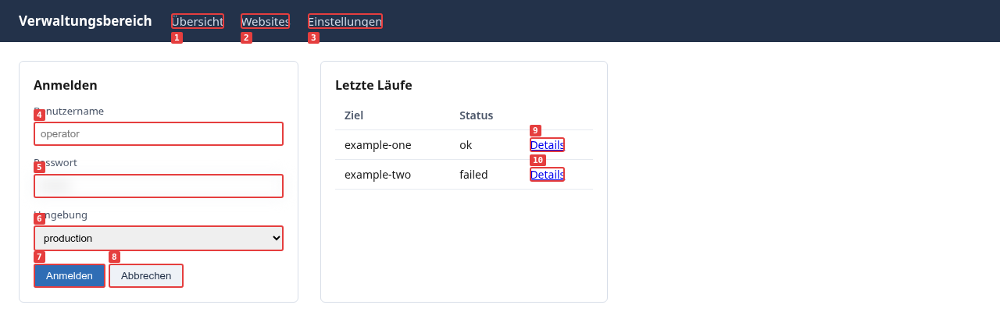

# Diwall – Betriebshandbuch

**Version 1.23.0 – August 2026**

*Ebenfalls auf Französisch, Deutsch und Spanisch unter `docs/fr/`, `docs/de/` und `docs/es/`.*

Dieses Dokument beantwortet eine Frage: **wie man X mit Diwall macht.**

**Wenn Sie ein Benutzer sind** – keine Befehle erforderlich. Sagen Sie Ihrem Modell, welche Website, Webanwendung oder Verwaltungsinterface Sie besuchen, beobachten oder nutzen möchten.
Das Modell liest diese Anleitung und übersetzt Ihre Absicht in die richtigen Aktionen.

**Wenn Sie ein Sprachmodell sind** – dies sind Ihre Befehle. Führen Sie sie direkt aus.

Keine architektonischen Beschreibungen. Befehle, die funktionieren.

---

## Inhaltsverzeichnis

1. [Installation überprüfen](#1-installation-überprüfen)
2. [Eine Seite erfassen](#2-eine-seite-erfassen)
3. [Respektvolle Navigation (v1.15.0)](#3-respektvolles-navigieren-v1150)
4. [Verschlüsseltes Verzeichnis und Zugangsdaten](#4-verschlüsseltes-verzeichnis-und-zugangsdaten)
5. [Ein RPA-Szenario erstellen und ausführen](#5-schreiben-und-ausführen-eines-rpa-szenarios)
6. [Aktionen – vollständige Referenz](#6-aktionen--vollständige-referenz)
7. [Häufige Probleme beheben](#7-umgang-mit-häufigen-hindernissen)
8. [Visuelle Überwachung — watch.py](#8-visuelle-überwachung--watchpy)
9. [Betriebsprotokoll](#9-betriebsprotokoll)
10. [CLI-Flags – Referenz](#10-befehlszeilenparameter--referenz)
11. [Exit-Codes und Ausgabe](#11-rückgabecodes-und-ausgabe)

---

## 1. Installation überprüfen

```bash
# Günstigster möglicher Test – ohne Playwright, ohne URL, sofortiger Exit mit Code 0 (v1.18.0+).
/opt/diwall/venv/bin/python3 /opt/diwall/shot.py --version
# → {"outil": "shot.py", "version": "1.23.0"}
```

```bash
# Vollständiger Test mit einem Befehl (~3 Sekunden).
/opt/diwall/venv/bin/python3 /opt/diwall/shot.py \
  --url https://example.com --mode fast --guide-version 1.2
```

Erwartetes Ergebnis: JSON auf stdout mit `"succes": true`.

**`--guide-version` (v1.18.0+):** `shot.py`, `rpa.py`, und `watch.py` weigern sich,
ohne dies zu funktionieren — es sei denn, ein lokaler Marker von einem vorherigen erfolgreichen Aufruf existiert bereits (`~/.config/diwall/guide_state.json`). Der Wert ist der
`<!-- notice-version: X.Y -->` in Zeile 3 von `docs/GUIDE_LLM.md` — nicht die
Diwall-Versionsnummer. Lesen Sie den aktuellen Wert anstatt sich auf einen hier angegebenen Wert zu verlassen: `grep notice-version /opt/diwall/docs/GUIDE_LLM.md`. Sehen Sie sich
den Abschnitt "Obligatorische Vorabprüfung" in `docs/GUIDE_LLM.md` für den vollständigen Mechanismus und
das Fehlerformat an, wenn Sie diesen Schritt überspringen.

Sobald der Marker existiert, wird `--guide-version` wieder optional. Alle anderen Befehlsbeispiele in diesem Handbuch lassen ihn absichtlich weg, da ein Marker von jedem vorherigen erfolgreichen Aufruf sie bereits abdeckt, solange sich `docs/GUIDE_LLM.md`'s `notice-version` seitdem nicht geändert hat.

```bash
# Überprüfen Sie die installierte Version.
grep "__version__" /opt/diwall/shot.py
# → __version__ = "1.23.0"

# Überprüfen Sie, ob `playwright-stealth` verfügbar ist (Version v1.15.0).
/opt/diwall/venv/bin/python3 -c "import playwright_stealth; print('stealth OK')"

# Überprüfen Sie, ob das verschlüsselte Verzeichnis gemountet ist.
ls ~/Vaults/__PROJET__/Diwall/
# → müssen `.json`-Dateien anzeigen, keine leere Liste.
```

Wenn `ls ~/Vaults/...` eine leere Liste oder einen Fehler zurückgibt:
→ mounten Sie es: `bash ~/git/Diwall/Diwall/scripts/monter-repertoire-chiffre.sh`

### 1a. Installation aus dem Debian-Paket – der einfache Weg

Das `.deb` ist ein Release-Asset auf GitHub. Es ist der empfohlene Weg, es sei denn,
Sie möchten den eigenen Code von Diwall ändern, in diesem Fall siehe 1b. Die beiden Wege
sind auf einer einzelnen Maschine gegenseitig ausschließend – beide zielen auf `/opt/diwall/`.

```bash
sudo apt install ./diwall_1.23.0-1_all.deb
diwall-shot --version
man diwall
```

Die Installation von `.deb` erfordert Netzwerkzugriff (die Abhängigkeitsinstallation und der Chromium-Download erfolgen während `postinst`). Sechs Befehle werden verfügbar, wobei jeder eine einfache Wrapper-Funktion darstellt – es gibt keinen funktionalen Unterschied zu den eigenen Aufrufen des git-clone-Kanals:

| Befehl | Umfasst |
|---|---|
| `diwall-shot` | `shot.py` |
| `diwall-rpa` | `rpa.py` |
| `diwall-watch` | `watch.py` |
| `diwall-monter-secrets` | `scripts/monter-repertoire-chiffre.sh` |
| `diwall-demonter-secrets` | `scripts/demonter-repertoire-chiffre.sh` |
| `diwall-monitor-verifier` | `scripts/monitor-verifier.sh` |

**Die Konfiguration befindet sich auf einem anderen Pfad in diesem Kanal:**
`/etc/diwall/diwall.conf` (nicht `/opt/diwall/diwall.conf`) – eine Vorlage wird
in `/etc/diwall/diwall-sample.conf` abgelegt, wird aber niemals automatisch aktiviert:

```bash
sudo cp /etc/diwall/diwall-sample.conf /etc/diwall/diwall.conf
sudo nano /etc/diwall/diwall.conf
sudo usermod -aG diwall $USER
```

`apt remove diwall` behält `/var/log/diwall/` (Operationsprotokoll, Beweismittel)
unverändert – `apt purge diwall` löscht es ebenfalls. `~/Vaults/` wird von keiner der beiden Funktionen auf beiden Kanälen beeinflusst.

**Handbuchseite (v1.22.0):** `man diwall` dokumentiert alle sechs Befehle auf
einer einzigen Seite. Die fünf anderen Befehlsnamen (`man diwall-rpa` und so
weiter) verweisen auf dieselbe Seite. Sie wird beim Bauen aus
`debian/diwall.1.md` erzeugt und kann daher nicht unbemerkt veralten — für die
vollständige Optionsliste eines Befehls bleibt jedoch `--help` massgeblich
gegenüber der Handbuchseite.

### 1b. Installation aus dem Quellcode – für die Modifikation von Diwall selbst

Verwenden Sie diesen Kanal nur, wenn Sie den Code von Diwall selbst ändern
wollen: er legt das Repository dorthin, wo `deploy.sh` Ihre Änderungen nach
`/opt/diwall/` übertragen kann. Für den einfachen Gebrauch genügt das `.deb`
oben mit einem einzigen Befehl und leistet dasselbe.

```bash
# 1. Erstellen Sie einen Systembenutzer und ein Verzeichnis.
sudo useradd --system --no-create-home --shell /bin/false diwall
sudo mkdir -p /opt/diwall
sudo chown root:diwall /opt/diwall

# 2. Klonen Sie das Repository.
git clone https://github.com/ronandavalan/diwall.git ~/git/Diwall/Diwall
cd ~/git/Diwall/Diwall

# 3. Erstellen Sie eine virtuelle Python-Umgebung.
sudo /usr/bin/python3 -m venv /opt/diwall/venv
sudo /opt/diwall/venv/bin/pip install -r requirements.txt

# 4. Chromium installieren.
sudo /opt/diwall/venv/bin/playwright install chromium

# 5. Bereitstellen.
bash ~/git/Diwall/Diwall/scripts/deploy.sh

# 6. Erstellen Sie Ihr verschlüsseltes Verzeichnis für Zugangsdaten.
mkdir -p ~/Vaults/<your-project>/Diwall
# Erstellen Sie die Datei `~/Vaults/<ihr-projekt>/Diwall/<hostname>.json` mit Ihren Zugangsdaten.
```

Auf diesem Kanal ist die Konfiguration `/opt/diwall/diwall.conf`, nicht
`/etc/diwall/diwall.conf`. Deinstallieren Sie zuerst mit
`bash ~/git/Diwall/Diwall/scripts/uninstall.sh --dry-run`, dann ohne
das Flag.

**Paket erstellen (Pfleger):**

```bash
bash ~/git/Diwall/Diwall/scripts/construire-paquet.sh
```

Erstellt und archiviert dann die drei Artefakte (`.deb`, `.buildinfo`, `.changes`)
unter `~/git/Diwall/paquets/<version>/`. Alle Versionen werden beibehalten: das
`.buildinfo` ist der einzige Nachweis für die genaue Umgebung, in der ein Paket erstellt wurde, und es hat keinen Wert, wenn es nicht gespeichert wird.

---

## 2. Eine Seite erfassen

### 2a. Schnelle Aufnahme – nur Text, ohne PNG (~2 Sekunden)

```bash
/opt/diwall/venv/bin/python3 /opt/diwall/shot.py \
  --url https://target.local/ \
  --mode fast
```

Gibt Folgendes zurück: `a11y_tree` (Textstruktur der Seite), `boussole` (effektive URL, Titel).
Verwenden Sie dies, wenn Sie den Titel lesen, die URL überprüfen oder Text extrahieren möchten, ohne ein PNG zu erfassen.

### 2b. Vollständige visuelle Erfassung mit nummerierten Elementen

```bash
/opt/diwall/venv/bin/python3 /opt/diwall/shot.py \
  --url https://target.local/ \
  --som --a11y
```

Gibt zurück:
- `capture`: Pfad zur PNG-Datei der Seite
- `capture_som`: PNG mit Nummern auf anklickbaren Elementen (SoM)
- `elements_som`: JSON-Liste der Elemente (id, tag, text)
- `a11y_tree`: Barrierefreiheitsbaum



*Was `--som` erzeugt. Die Zahlen im Bild sind die `id` Werte in
`elements_som`, sodass das Anklicken zu `{"type": "cliquer_som", "id": 7}` wird – es gibt keine
Auswahlmöglichkeiten, bei denen man raten müsste. Generiert aus einer Version eines Fixtures, die in diesem Repository gespeichert ist
(`scenarios/interoperabilite/fixture/`); dieselbe Grafik existiert auch auf Französisch,
Deutsch und Spanisch neben dieser.*

### 2c. Lesen Sie zuerst die Gebrauchsanweisung

Jede Ausgabe enthält ein `boussole`-Objekt — lesen Sie es vor allem anderen:

```json
"boussole": {
  "url_courante": "https://target.local/dashboard",
  "titre_page": "Dashboard — My App",
  "auth_status": "active",
  "stealth_actif": true,
  "respect": {
    "pages_visitees": 0,
    "actions_executees": 3,
    "duree_totale_ms": 2140
  }
}
```

Wenn `boussole.url_courante` nicht Ihrer Erwartung entspricht: anhalten und
prüfen, bevor Sie irgendeine verändernde Aktion ausführen.

### 2d. Lesen Sie `etat` für eine Ja/Nein-Entscheidung (Version 1.16.0)

Jede erfolgreiche Ausführung enthält ein `etat` Objekt im JSON-Root – lesen Sie es,
bevor Sie eine verändernde Aktion durchführen, anstatt manuell `auth_status`,
`respect.plafond_atteint`, `erreurs_js`, und `erreurs_console` selbst zu überprüfen:

```json
"etat": {
  "pret_a_agir": true,
  "niveau_confiance": "eleve",
  "raisons": ["aucun signal de friction détecté"]
}
```

Wenn `pret_a_agir` gleich `false` ist: Lesen Sie `raisons` zur Ursache (inaktive Authentifizierung, Session-Abdrift, Erreichen der Navigationsgrenze oder ein erkannten WAF-Block), bevor Sie fortfahren.

`etat` überprüft nicht, ob die URL oder der Seiteninhalt Ihren Geschäftserwartungen entspricht – verwenden Sie dazu `evaluer` mit `attendu`/`contient`/`motif` (Abschnitt 5d).

### 2e. `mode_conseille` — Hinweise zur Vorflugkonfiguration (Version 1.18.0)

Wenn Diwall über reale Vorabdaten zum Host verfügt, den Sie anrufen – von einer früheren `diagnostic_dom.json` Ausführung gegen diesen Host –, dann gibt `etat` eine Empfehlung für Ihren **nächsten** Anruf ab, die jedoch niemals automatisch angewendet wird:

```json
"etat": {
  "pret_a_agir": true,
  "niveau_confiance": "eleve",
  "raisons": ["mode_conseille disponible : full recommandé (React détecté sur ce host)"],
  "mode_conseille": {
    "mode": "full",
    "shadow_dom": true,
    "som_rafraichir": false,
    "raisons": ["react_detecte", "shadow_roots:3"]
  }
}
```

Um diese Daten für einen bestimmten Host zu erhalten, führen Sie die Diagnose einmal aus:

```bash
/opt/diwall/venv/bin/python3 /opt/diwall/rpa.py \
  --scenario /opt/diwall/scenarios/diagnostic_dom.json \
  --url https://target.local/ --mode fast
```

Keine vorherige Diagnose für diesen Host → `mode_conseille` ist nicht vorhanden, es gibt keine Vermutungen. Vollständige Details in `GUIDE_LLM_MONITORING.md`.

---

## 3. Respektvolles Navigieren (v1.15.0)

### 3a. Stealth-Modus `--stealth`

Einige Websites blockieren Browser ohne grafische Oberfläche auf `navigator.webdriver=true`
ohne die Absicht zu prüfen. `--stealth` entfernt diese automatische technische Kennzeichnung.

```bash
# direkt shot.py
/opt/diwall/venv/bin/python3 /opt/diwall/shot.py \
  --url https://target.local/ \
  --som --stealth

# Über rpa.py
/opt/diwall/venv/bin/python3 /opt/diwall/rpa.py \
  --scenario /opt/diwall/scenarios/my-scenario.json \
  --stealth
```

Wenn aktiv: `boussole.stealth_actif = true` in der JSON-Ausgabe.

**Was `--stealth` verändert:** `navigator.webdriver` wurde entfernt, Plugins/languages/platform wurden normalisiert.
**Was `--stealth` nicht verändert:** die IP-Adresse, Identität oder Navigationsabsicht des Nutzers.

### 3b. Höflichkeitsbedingte Verzögerungen

Konfiguriert in `/opt/diwall/diwall.conf`:

```json
{
  "secrets_dir": "~/Vaults/__PROJET__/Diwall",
  "navigation": {
    "min_action_delay_ms": 800,
    "max_pages_par_run": 10,
    "max_actions_par_run": 30
  }
}
```

`min_action_delay_ms`: minimale Verzögerung (ms) zwischen jeder Aktion. Versandbereit.
Standardwert: 800 ms.

Lokale Entwicklung – setzen Sie sie auf `0` (v1.19.0): die Standardeinstellung von 800 ms schützt einen unaufmerksamen Benutzer bei seiner *ersten, nicht konfigurierten* Ausführung vor dem öffentlichen Internet – sie hat keinen Schutzzweck für Ihre eigene Entwicklungs-/Produktionsmaschine, wo nichts dazu aufgefordert wird, sich bestimmtes Verhalten aufzuerpringen. Legen Sie den Schlüssel explizit in Ihrer lokalen Datei `diwall.conf` fest:

```json
{
  "navigation": {
    "min_action_delay_ms": 0
  }
}
```

Behalten Sie die Standardeinstellung von 800 ms (oder erhöhen Sie sie) für alle Ziele, die über das öffentliche Internet erreichbar sind. Der Wert ist immer eine bewusste Wahl, die mit dem Ziel verknüpft ist und keine feste Eigenschaft des Tools – siehe die WAF- und Stealth-Anleitungen in `docs/GUIDE_LLM.md` für dasselbe Prinzip, angewendet auf blockierendes Verhalten.

Die `max_pages_par_run` und `max_actions_par_run` Grenzwerte stoppen den Ablauf sauber,
falls sie überschritten werden. Es gibt keine Ausnahme – die Ausgabe im JSON-Format enthält:

```json
"respect": {
  "pages_visitees": 10,
  "actions_executees": 10,
  "duree_totale_ms": 12400,
  "plafond_atteint": "max_pages_par_run"
}
```

### 3c. Kennzahlen zur Bewertung der Auswirkungen

Jeder Lauf gibt `respect` zurück (in der JSON-Wurzel und in boussole):

| Schlüssel | Bedeutung |
|---|---|
| `pages_visitees` | Anzahl der ausgeführten `type: naviguer`-Navigationen |
| `actions_executees` | Gesamtzahl der ausgeführten Szenario-Aktionen |
| `duree_totale_ms` | Gesamtdauer des Laufs |
| `plafond_atteint` | `"max_pages_par_run"` oder `"max_actions_par_run"` bei vorzeitigem Abbruch |

### 3d. Stealth-Benchmark – quantitativ (Version 1.17.1)

Zählen Sie konkrete Fingerabdruck-Signale, statt Bildschirmaufnahmen mit blossem
Auge zu vergleichen — mit dieser Methode wurde die Korrektur der
API-Kompatibilität von `playwright-stealth` in v1.17.0 überprüft
(`docs/RETOUR_EXPERIENCE.md` FR-79):

```bash
# Ohne Heimlichkeit.
/opt/diwall/venv/bin/python3 /opt/diwall/shot.py \
  --url https://bot.sannysoft.com --no-capture --timeout 20000 \
  --actions '[{"type":"evaluer","script":"navigator.webdriver"},
               {"type":"evaluer","script":"document.querySelectorAll(\"td.failed\").length"},
               {"type":"evaluer","script":"document.querySelectorAll(\"td.passed\").length"}]'

# Mit Heimlichkeit.
/opt/diwall/venv/bin/python3 /opt/diwall/shot.py \
  --url https://bot.sannysoft.com --no-capture --stealth --timeout 20000 \
  --actions '[{"type":"evaluer","script":"navigator.webdriver"},
               {"type":"evaluer","script":"document.querySelectorAll(\"td.failed\").length"},
               {"type":"evaluer","script":"document.querySelectorAll(\"td.passed\").length"}]'
```

Lesen Sie die drei Werte in `evaluations[].valeur` aus: `navigator.webdriver` sollte von `true` zu `false` wechseln, `td.failed` sollte sich in Richtung `0` verringern. Referenzmessung (Korrektur v1.17.0, Sitzung 47): 12 Fehler → 0 Fehler.

Für eine qualifizierte Zweitmeinung erzeugt das beschriebene Szenario weiterhin Screenshots zur Inspektion:

```bash
/opt/diwall/venv/bin/python3 /opt/diwall/rpa.py \
  --scenario /opt/diwall/scenarios/test_stealth.json \
  --output-dir /tmp/diwall/stealth_with --stealth
```

`capture_sannysoft_*.png` und `capture_intoli_*.png` landen in diesem Verzeichnis.
Hinweis: Beide Zielseiten diskutieren in ihren Inhalten die Erkennung von Bots, was
`respect.waf_bloquants` als falsch-positive Meldung auslösen kann (Abschnitt 3e) –
was bei diesem spezifischen Benchmark zu erwarten ist und kein Zeichen für eine tatsächliche Sperrung darstellt.

### 3e. Erkennungssignal für Web Application Firewall (WAF) (Version 1.16.0, verfeinert in Version 1.17.2)

Diwall kennzeichnet einen wahrscheinlichen WAF-Block passiv – HTTP 403/429 oder eine Übereinstimmung von Titeln/HTML-Keywords (`Cloudflare`, `CAPTCHA`, `checking your browser`, usw.). Dies ist ein Signal, niemals eine Ausnahme – der Vorgang wird normal abgeschlossen:

```json
"respect": {
  "waf_bloquants": 1
}
```

Wenn vorhanden und `> 0`: `etat.niveau_confiance` ist `"faible"` und
`etat.pret_a_agir` ist `false`. Entscheiden Sie selbst, ob Sie es mit
`--stealth` erneut versuchen, das Ziel ändern oder stoppen möchten — Diwall bricht den Vorgang nicht für Sie ab.

Seit v1.17.2 greifen generische Herstellernamen (`Cloudflare`, `Akamai`) nur
noch im Seitentitel — der Abgleich mit dem vollständigen HTML erzeugte zuvor
Fehlalarme bei gewöhnlichen Verweisen auf CDN-Ressourcen. Hält ein Fehlalarm
an, senkt `--ignorer-waf` den `niveau_confiance`, ohne `pret_a_agir: false`
zu erzwingen (`boussole.waf_ignore_actif: true` hält die Übersteuerung fest).
Die Erkennung arbeitet mit Schlüsselwörtern und kann Fehlalarme erzeugen: eine
Seite, die einen dieser Begriffe legitim erwähnt, wird markiert.

---

## 4. Verschlüsseltes Verzeichnis und Zugangsdaten

### 4a. Struktur

Die Zugangsdaten befinden sich in einem verschlüsselten Verzeichnis – einem gocryptfs-Volume –, das eine `.json` Datei pro Domain enthält.

```
~/Vaults/__PROJET__/Diwall/
  ├── app.example.com.json         ← credentials for https://app.example.com/
  ├── admin.example.com.json       ← credentials for https://admin.example.com/
  └── operations.jsonl             ← operation log (v1.15.0)
```

Dateiformat für Anmeldeinformationen:

```json
{
  "username": "admin@example.com",
  "password": "my-password"
}
```

Der Dateiname ist = `urlparse(url).hostname`. Für `https://app.example.com/login/`, erstellen Sie `app.example.com.json`.

### 4b. Ein Formular ausfüllen – die unumstößliche Regel

**VERBOTEN – zeigt das Passwort im Shell-Fenster und `/proc`**:

```bash
PASS=$(jq -r '.password' ~/Vaults/.../file.json)   # NEVER
curl -d "password=$PASS" https://...                 # NEVER
```

**KORREKT – Zugangsdaten werden innerhalb von Playwright aufgelöst:**

```json
{"type": "remplir_som", "id": 2, "valeur": "depuis_secrets", "secret_cle": "username"},
{"type": "remplir_som", "id": 3, "valeur": "depuis_secrets", "secret_cle": "password"}
```

Werte gelangen niemals über die Shell, die Bash-Historie, Prozessprotokolle oder irgendeine Datei.

### 4c. Auswahl der Zugangsdatendatei für einen Durchlauf

```bash
# Standard-Zugangsdaten-Verzeichnis (definiert in diwall.conf > secrets_dir).
/opt/diwall/venv/bin/python3 /opt/diwall/shot.py --url https://target.local/ --som

# Datei mit expliziten Anmeldeinformationen (--secrets)
/opt/diwall/venv/bin/python3 /opt/diwall/shot.py \
  --url https://target.local/ --som \
  --secrets /path/to/mounted/directory/creds.json

# Projektbezogenes Zugangsdaten-Verzeichnis über .diwall.conf
export DIWALL_CONF=~/git/MyProject/.diwall.conf
/opt/diwall/venv/bin/python3 /opt/diwall/shot.py --url https://target.local/ --som
```

**Inhalt der Datei `--secrets` — `origines_autorisees` obligatorisch seit dem
05/08/2026** (Breaking Change, keine Übergangsfrist): Eine Datei ohne diesen Schlüssel wird vor jedem Lesevorgang verweigert.

```json
{"username": "operator", "password": "secret", "origines_autorisees": ["target.local"]}
```

`origines_autorisees` listet die Hostnamen auf, gegen die diese Datei verwendet werden darf –
im gleichen Kleinbuchstabenformat ohne Schema und Port wie `domaine_depuis_url()`. Ein Zugriff
auf eine Seite, deren Domain nicht in der Liste enthalten ist, wird verweigert
(`SecretsOrigineNonAutoriseeError`).

Inhalt von `~/git/MyProject/.diwall.conf` :

```json
{"secrets_dir": "../MyProject-secrets"}
```

Der Pfad wird relativ zum Speicherort von `.diwall.conf` aufgelöst.

### 4d. TOTP / Multi-Faktor-Authentifizierung

```json
{"type": "remplir_som", "id": 6, "valeur": "depuis_secrets_totp"}
```

Liest den Schlüssel `totp_cle` (Base32-Seed) aus der Zugangsdatendatei und generiert den aktuellen TOTP-Code.

Um den Code über ntfy zu erhalten (Workflow ohne menschliches Zutun):

```json
{"type": "attendre_mfa_ntfy", "id_som": 6, "timeout": 120}
```

### 4e. Integritätsprüfsumme (optional, ab Version 1.15.0)

Um eine Datei mit Anmeldeinformationen vor stillem Datenverlust durch FUSE zu schützen, fügen Sie ein `checksum` Feld hinzu:

```bash
# Generiere den Prüfsummenwert.
/opt/diwall/venv/bin/python3 -c "
import json, hashlib
creds = json.load(open('my_credentials.json'))
fields = {k: creds[k] for k in sorted(['username','password']) if k in creds}
print('sha256:' + hashlib.sha256(json.dumps(fields, sort_keys=True).encode()).hexdigest())
"
```

Fügen Sie den zurückgegebenen Wert der Datei mit den Anmeldeinformationen hinzu:

```json
{
  "username": "admin@example.com",
  "password": "my-password",
  "checksum": "sha256:a3f2c1..."
}
```

Stimmt die Prüfsumme nicht, löst `shot.py` `SecretsChecksumError` (Exit 42) mit einer eindeutigen Meldung aus.
Ohne den Schlüssel `checksum`: unverändertes Verhalten (striktes Opt-in).

### 4f. Verschlüsseltes Verzeichnis geschlossen – was tun?

```
SecretsFermesError: Le répertoire chiffré Diwall est initialisé mais non monté.
```

```bash
# Befestigen Sie das verschlüsselte Verzeichnis.
bash ~/git/Diwall/Diwall/scripts/monter-repertoire-chiffre.sh

# Überprüfen Sie die Montage.
ls ~/Vaults/__PROJET__/Diwall/
# → müssen JSON-Dateien anzeigen.
```

### 4g. HTTP-Basisauthentifizierung — `--http-credentials` (v1.21.0)

Für Ziele hinter einer HTTP Basic Auth-Authentifizierung auf Netzwerkebene (RFC 7617) –
ein Reverse Proxy wie Caddy, nginx oder Traefik stellt diese Herausforderung vor dem Laden jeglicher Seite bereit, was häufig vor selbst gehosteten Admin-Oberflächen zu finden ist. Dies ist ein anderer Mechanismus als die oben beschriebene formbasierte Authentifizierung (4a-4f), die weiterhin vollständig unterstützt wird und davon nicht betroffen ist.

```bash
/opt/diwall/venv/bin/python3 /opt/diwall/shot.py \
  --url https://internal.example/ \
  --http-credentials --secrets ~/Vaults/__PROJET__/Diwall/internal_example.json
```

Authentifizierungsdatei – das einfache `username` / `password` Paar wird bereits für den
üblichen Fall verwendet (ein einziger Satz von Authentifizierungsinformationen für das Ziel):

```json
{"username": "admin", "password": "my-password"}
```

Spezielle `http_username`/`http_password` Schlüssel werden zuerst ausprobiert und sind nur erforderlich, wenn das gleiche Ziel sowohl eine Netzwerk-basierte Basic Auth-Authentifizierung als auch einen separaten Anwendungslogin hat (zwei verschiedene Zugangsdaten im selben File). In diesem Fall greift Diwall automatisch auf `username`/`password` zurück, wenn die speziellen Schlüssel fehlen.

Bestätigt in der Produktion gegen ein echtes Caddy-geschütztes Ziel: die sichere
Standardeinstellung (`send: "unauthorized"` – Zugangsdaten werden nur nach einem echten
401 gesendet, niemals präventiv) löste die Herausforderung beim ersten Versuch.
`boussole.http_credentials_actif: true` bestätigt einen echten Erfolg, nicht nur
die Übergabe des Flags; `boussole.http_auth_requise: true` unterscheidet ein
nicht gelöstes 401 deutlich von einer WAF-Blockade.

---

## 5. Schreiben und Ausführen eines RPA-Szenarios

### 5a. 3-stufiges Protokoll

**Schritt 1 – Die Seite erkunden (nur lesen)**

```bash
# Schneller Überblick
/opt/diwall/venv/bin/python3 /opt/diwall/shot.py \
  --url https://target.local/ --mode fast

# Vollständige Ansicht mit nummerierten Elementen.
/opt/diwall/venv/bin/python3 /opt/diwall/shot.py \
  --url https://target.local/ --som --a11y

# Web-Komponenten-Anwendung (Angular, Lit, Stencil)
/opt/diwall/venv/bin/python3 /opt/diwall/shot.py \
  --url https://target.local/ --som --a11y --shadow-dom

# Verbesserter DOM-Inventar (Frameworks, Shadow Roots, stabile Datenattribute).
/opt/diwall/venv/bin/python3 /opt/diwall/rpa.py \
  --scenario /opt/diwall/scenarios/diagnostic_dom.json \
  --url https://target.local/ --mode fast
```

**Was festzuhalten ist:**
- Die SoM-Nummern der Felder und Schaltflächen (`capture_som` lesen)
- Stabile Attribute: `name`, `id`, `aria-label`, `data-testid`
- Blockierende Überlagerungen (Cookie-Banner, modale Fenster)
- SPA oder vollständiges HTTP-Neuladen

**Schritt 2 – Schreiben Sie das Szenario.**

```json
{
  "nom": "login_app",
  "url": "https://app.example.com/login/",
  "intention": "Administrator login with stored credentials",
  "actions": [
    {"type": "nettoyer_overlay", "selecteur": ".cookie-banner"},
    {"type": "remplir_som", "id": 1, "valeur": "depuis_secrets", "secret_cle": "username"},
    {"type": "remplir_som", "id": 2, "valeur": "depuis_secrets", "secret_cle": "password"},
    {"type": "cliquer_som", "id": 3},
    {"type": "attendre_selecteur_present", "selecteur": ".user-avatar"},
    {"type": "capturer", "nom": "after-login"}
  ]
}
```

**Schritt 3 – Ausführen**

```bash
/opt/diwall/venv/bin/python3 /opt/diwall/rpa.py \
  --scenario /opt/diwall/scenarios/login_app.json --som
```

### 5b. Vollständiges Szenario: Anmelden und zwischen Seiten navigieren

```json
{
  "nom": "audit_pages",
  "url": "https://app.example.com/login/",
  "intention": "Visual audit after deployment",
  "actions": [
    {"type": "remplir_som", "id": 1, "valeur": "depuis_secrets", "secret_cle": "username"},
    {"type": "remplir_som", "id": 2, "valeur": "depuis_secrets", "secret_cle": "password"},
    {"type": "cliquer_som", "id": 3},
    {"type": "attendre_selecteur_present", "selecteur": ".dashboard-main"},
    {"type": "capturer", "nom": "dashboard"},
    {"type": "naviguer", "url": "https://app.example.com/settings/"},
    {"type": "attendre_navigation"},
    {"type": "capturer", "nom": "settings"},
    {"type": "naviguer", "url": "https://app.example.com/users/"},
    {"type": "attendre_navigation"},
    {"type": "capturer", "nom": "users"}
  ]
}
```

### 5c. Daten aus dem DOM extrahieren

```json
{
  "nom": "extract_counters",
  "url": "https://app.example.com/dashboard/",
  "actions": [
    {"type": "evaluer", "script": "document.title"},
    {"type": "evaluer", "script": "document.querySelectorAll('.user-row').length"},
    {"type": "evaluer", "script": "window.location.href"}
  ]
}
```

Ergebnis in `evaluations[]` :

```json
"evaluations": [
  {"index": 0, "script": "document.title", "valeur": "Dashboard — My App"},
  {"index": 1, "script": "...", "valeur": 42},
  {"index": 2, "script": "...", "valeur": "https://app.example.com/dashboard/"}
]
```

### 5d. Aussagen zu evaluer (rpa.py nur)

Drei sich gegenseitig ausschließende Schlüssel – jeweils einer pro Aktion:

```json
{"type": "evaluer", "script": "document.querySelectorAll('.row').length", "attendu": 3}
{"type": "evaluer", "script": "document.title", "contient": "Dashboard"}
{"type": "evaluer", "script": "window.location.href", "motif": "/dashboard$"}
```

| Key | Vergleich | Gültige Typen |
|---|---|---|
| `attendu` | strikte Gleichheit `==` | str, int, bool |
| `contient` | Teilstring `in` | nur str |
| `motif` | `re.search()` Python | nur str |

Schlägt die Zusicherung fehl: rpa.py hält sofort an (Exit 1), vor jeder weiteren verändernden Aktion.

### 5e. Unter-Szenarien (declencher_scenario)

Definieren Sie eine Anmeldung als wiederverwendbares Teil-Szenario:

```json
{
  "nom": "login_app",
  "url": "https://app.example.com/login/",
  "actions": [
    {"type": "remplir_som", "id": 1, "valeur": "depuis_secrets", "secret_cle": "username"},
    {"type": "remplir_som", "id": 2, "valeur": "depuis_secrets", "secret_cle": "password"},
    {"type": "cliquer_som", "id": 3},
    {"type": "attendre_selecteur_present", "selecteur": ".user-avatar"}
  ]
}
```

Rufen Sie dieses Unter-Szenario von einem anderen Szenario aus auf:

```json
{
  "nom": "full_audit",
  "url": "https://app.example.com/login/",
  "actions": [
    {"type": "declencher_scenario", "scenario": "login_app"},
    {"type": "naviguer", "url": "https://app.example.com/report/"},
    {"type": "capturer", "nom": "report"}
  ]
}
```

Maximale Verschachtelungstiefe: 5 Ebenen.

### 5f. Überprüfen Sie, ob Sie sich auf der richtigen Seite befinden, bevor Sie Änderungen vornehmen

Fügen Sie immer eine Sicherheitsmaßnahme als erste Aktion in Szenarien hinzu, die Daten löschen oder ändern:

```json
{"type": "evaluer", "script": "window.location.href", "contient": "/dashboard"},
{"type": "evaluer", "script": "document.querySelector('.alert-danger')?.textContent ?? null", "attendu": null}
```

Wenn die Sicherheitsprüfung fehlschlägt: rpa.py stoppt, bevor die Löschung ausgeführt wird.

### 5g. Eine Sitzung fortsetzen (mit persistenten Cookies)

```bash
# Erster Aufruf – Authentifizierung und Speicherung der Sitzung.
/opt/diwall/venv/bin/python3 /opt/diwall/shot.py \
  --url https://app.example.com/login/ \
  --actions /tmp/login.json \
  --sauver-session /tmp/diwall/session.json \
  --som

# Nachfolgende Aufrufe – Wiederverwendung der Sitzung (kein erneutes Anmelden).
/opt/diwall/venv/bin/python3 /opt/diwall/shot.py \
  --url https://app.example.com/dashboard/ \
  --reprendre-session /tmp/diwall/session.json \
  --som
```

**Signal für Session-Ablauf:** Wenn die Sitzung abgelaufen ist, steht dort `boussole.session_derive: true` im JSON.
In diesem Fall: Starte den vollständigen Login neu, ohne `--reprendre-session`.

### 5h. Strukturelle Nicht-Regression ohne Pixel – `--replay-verifier` (v1.17.0)

```bash
# Erster Durchlauf – Speichern Sie die strukturelle Referenz.
/opt/diwall/venv/bin/python3 /opt/diwall/rpa.py \
  --scenario /opt/diwall/scenarios/dashboard.json \
  --sauver-verifier-reference /tmp/dashboard.ref.json

# Nachfolgende Durchläufe – vergleichen.
/opt/diwall/venv/bin/python3 /opt/diwall/rpa.py \
  --scenario /opt/diwall/scenarios/dashboard.json \
  --replay-verifier /tmp/dashboard.ref.json
```

Vergleicht die Ergebnisse von `http_status`, `dom_stats`, `evaluer` und die Anzahl der Elemente des SoM (nicht den Inhalt) mit der gespeicherten Referenz. Urteil in stderr:

```json
{"type_comparaison": "replay_verifier", "verdict": "stable", "diffs": []}
```

Exit 1 bei `verdict: "regression"`, wobei `diffs` jedes abweichende Feld
auflistet (`reference` gegen `obtenu`). Die beiden Optionen schliessen sich
gegenseitig aus.

### 5i. Ein langes Szenario nach einem Fehler fortsetzen — `--checkpoint` (v1.17.0)

```bash
/opt/diwall/venv/bin/python3 /opt/diwall/rpa.py \
  --scenario /opt/diwall/scenarios/long_audit.json \
  --checkpoint /tmp/long_audit.checkpoint.json
```

Schlägt das Szenario unterwegs fehl, wird `/tmp/long_audit.checkpoint.json`
geschrieben, mit der Anzahl der abgeschlossenen Aktionen und einer Sitzungsdatei.
**Starten Sie genau denselben Befehl erneut**, um fortzusetzen: bereits
abgeschlossene Aktionen werden übersprungen. Bei vollem Erfolg wird die
Checkpoint-Datei automatisch gelöscht.

Ein abgebrochener Durchlauf aufgrund einer Navigationsbeschränkung (`max_actions_par_run`/`max_pages_par_run`)
wird seit Version v1.17.2 auf die gleiche Weise behandelt wie ein teilweiser Fehler – der Checkpoint
wird mit dem tatsächlichen Fortschritt aktualisiert und nicht gelöscht. Vor Version v1.17.2 wurde er
in diesem Fall ebenfalls gelöscht (er gibt das gleiche `succes: true` Signal wie ein
vollständig abgeschlossener Abschnitt) und verliert dabei stillschweigend alle verbleibenden Fortschritte bei langen Szenarien.

Der DOM-Zustand (geöffnete Dialogfenster, halb ausgefüllte Formulare) wird nie über ein Neustart gespeichert – nur Cookies/`localStorage` und die Position in der Aktionsliste werden erhalten. Verlassen Sie sich nicht auf `--checkpoint`, um eine mehrstufige Formularausfüllung fortzusetzen; es setzt die Ausführung nur an den Grenzen von Aktionen fort.

### 5j. Elemente innerhalb eines Iframes ansteuern (Version 1.17.0)

Es findet keine Nummerierung mit "Set-of-Mark" innerhalb eines `<iframe>` statt (weder bei derselben Herkunft als auch bei unterschiedlicher Herkunft) – greifen Sie stattdessen direkt über einen CSS-Selektor darauf zu:

```json
{"type": "cliquer_iframe", "iframe_selecteur": "iframe#paiement", "selecteur": "button.valider"},
{"type": "remplir_iframe", "iframe_selecteur": "iframe#paiement", "selecteur": "input[name=cvv]", "valeur": "depuis_secrets", "secret_cle": "cvv"}
```

`remplir_iframe` unterstützt `valeur: "depuis_secrets"` genau wie `remplir`.
(Abschnitt 4b) – es gibt niemals eine Klartext-Anmeldeinformation in diesem Szenario. Wenn das Ziel-
Element die Interaktion verweigert (z. B. ein `contenteditable` Bereich in einem schreibgeschützten
Zustand), fügen Sie `"force": true` zu `cliquer_iframe` hinzu – dieselbe Semantik wie `cliquer`.
(Abschnitt 7e).

Um den internen Selektor zu finden: Verwenden Sie `evaluer` im Inhalt des Iframes, wenn er die gleiche Herkunft hat (`document.querySelector('iframe').contentDocument...`), oder
konsultieren Sie die eigene Markup-/Dokumentation der Zielanwendung, wenn sie eine andere Herkunft hat.

### 5k. Verschachtelte Iframes — `iframe_chemin` (v1.18.0)

Ein Iframe innerhalb eines anderen Iframes: Ersetzen Sie `iframe_selecteur` durch
`iframe_chemin`, ein geordnetes Array – ein CSS-Selektor pro Verschachtelungsebene, von
äußerster bis innerster.

```json
{"type": "cliquer_iframe", "iframe_chemin": ["iframe#wrapper", "iframe#paiement"], "selecteur": "button.valider"},
{"type": "remplir_iframe", "iframe_chemin": ["iframe#wrapper", "iframe#paiement"], "selecteur": "input[name=cvv]", "valeur": "depuis_secrets", "secret_cle": "cvv"}
```

`iframe_selecteur` (einzelner Frame) und `iframe_chemin` (verschachtelte Einbettung) sind
gegenseitig ausschließend – genau eines ist pro Aktion erforderlich. Für einen iframe der obersten Ebene, verwenden Sie weiterhin `iframe_selecteur` (Abschnitt 5j).

---

## 6. Aktionen – vollständige Referenz

| Typ | Erforderliche Parameter | Optionale Parameter | Hinweise |
|---|---|---|---|
| `naviguer` | `url` | — | Vollständiges HTTP-Neuladen. Wird in `respect.pages_visitees` gezählt |
| `cliquer` | `selecteur` | `force` (bool), `repli_js` (bool) | `force: true` umgeht CSS-versteckte Elemente oder zeigt ein Modal an. `repli_js: true` wiederholt den Klick über JavaScript, falls der native Klick fehlschlägt (v1.22.0) – benötigt `--no-evaluer` deaktiviert |
| `cliquer_som` | `id` | — | Klickt in die Mitte des Elements. Kein `force` erforderlich |
| `cliquer_visuel` | `description` | — | LLM-Vision (~32 s). Letzte Möglichkeit für Canvas oder Elemente ohne Attribute |
| `remplir` | `selecteur`, `valeur` | `secret_cle` | `valeur: "depuis_secrets"` löst die gespeicherten Zugangsdaten |
| `remplir_som` | `id`, `valeur` | `secret_cle` | Löscht das Feld vor dem Tippen. `valeur: "depuis_secrets_totp"` für TOTP |
| `capturer` | `nom` | `som` (bool) | Benanntes Zwischen-PNG. `som: true` für einen annotierten Screenshot |
| `evaluer` | `script` | `attendu`, `contient`, `motif` | JavaScript wird im Browser ausgeführt. Assertions nur für rpa.py |
| `defiler` | `px` oder `selecteur` | — | Vertikales Scrollen in Pixeln (`px`) oder Scrollen zu einem Element (`selecteur`) |
| `pause` | `ms` | `interval_capture` | Feste Verzögerung in ms. Bevorzugt `attendre_selecteur_present` für DOM-Signale |
| `attendre` | `selecteur` | `interval_capture` | Wartet, bis ein CSS-Selektor vorhanden ist |
| `attendre_navigation` | — | — | Wartet auf `networkidle` (Ende der Netzwerkaktivität) |
| `attendre_url` | `motif` | `attendre_changement` (bool) | Die URL enthält ein Muster (teilweise Übereinstimmung). `attendre_changement: true`, wenn die aktuelle URL bereits das Muster enthält |
| `attendre_selecteur_present` | `selecteur` | — | Wartet, bis ein Element sichtbar ist (Zustand=sichtbar) |
| `attendre_absence` | `selecteur` | `delai_initial_ms` | Wartet, bis ein Element aus dem DOM entfernt wird (Zustand=abgetrennt) |
| `attendre_reseau_calme` | — | `timeout_ms` | 500 ms Netzwerkaktivität. `timeout_ms`: maximale Dauer, bevor abgebrochen wird |
| `attendre_mfa_ntfy` | `id_som` | `timeout` | Wartet auf einen TOTP-Code über ntfy und füllt ihn in das SoM-Feld ein |
| `nettoyer_overlay` | `selecteur` | — | Versteckt blockierende Overlays (Cookie-Banner, Modal). Vor der Verwendung von SoM verwenden |
| `declencher_scenario` | `scenario` | — | Fügt Aktionen eines Unter-Szenarios inline ein. Maximale Tiefe: 5 |
| `cliquer_iframe` | `iframe_selecteur` \| `iframe_chemin`, `selecteur` | `force` (bool) | Klickt innerhalb eines Iframes (v1.17.0). `iframe_chemin` für verschachtelte Iframes (v1.18.0, Abschnitt 5k). Kein SoM innerhalb von Frames |
| `remplir_iframe` | `iframe_selecteur` \| `iframe_chemin`, `selecteur`, `valeur` | `secret_cle` | Füllt innerhalb eines Iframes aus (v1.17.0). `iframe_chemin` für verschachtelte Iframes (v1.18.0). `valeur: "depuis_secrets"` unterstützt |

---

## 7. Umgang mit häufigen Hindernissen

### 7a. Cookie-Banner / Sperrbanner

```json
{"type": "nettoyer_overlay", "selecteur": ".cookie-consent-banner, #gdpr-overlay"}
```

Platzieren Sie dies **vor** jeder anderen Aktion und vor dem SoM. Die Überlagerung maskiert Elemente, die mit SoM-Nummern versehen sind.
Verwenden Sie dies nicht in `watch.py` Szenarien (die Überlagerung ist Teil der visuellen Referenz).

### 7b. Element außerhalb des sichtbaren Bereichs

SoM warnt, wenn ein interaktives Element außerhalb des Bildschirms liegt:

```json
"som_hors_viewport": 3,
"avertissement_scroll": "3 interactive element(s) off-viewport — use defiler before cliquer_som"
```

```json
{"type": "defiler", "selecteur": "#the-button"},
{"type": "remplir_som", "id": 7, "valeur": "depuis_secrets", "secret_cle": "username"}
```

### 7c. Web-Komponenten – Shadow DOM

Wenn sichtbare, interaktive Elemente keine SoM-Nummer erhalten:

```bash
/opt/diwall/venv/bin/python3 /opt/diwall/shot.py \
  --url https://target.local/ --som --shadow-dom
```

Oder im Szenario: `"shadow_dom": true` am Anfang.

Wann verwenden: Angular, Lit, Stencil, FAST. Nicht in Projekten ohne Web-Komponenten aktivieren.

Um auf ein Element innerhalb eines Shadow Roots zuzugreifen, ohne `--shadow-dom` zu verwenden:

```json
{"type": "evaluer", "script": "document.querySelector('my-component').shadowRoot.querySelector('button').click()"}
```

### 7d. Single-Page Applications (SPA) (React, Vue, Angular) – Navigation ohne Neuladen

Nach einem Klick, der die Ansicht in einer Single-Page-Anwendung (SPA) verändert, weiß Playwright nicht, wann die Navigation abgeschlossen ist.

```json
{"type": "cliquer_som", "id": 5},
{"type": "attendre_url", "motif": "/dashboard"},
{"type": "evaluer", "script": "document.title", "contient": "Dashboard"}
```

Oder warten Sie auf ein Element, das spezifisch für die neue Ansicht ist:

```json
{"type": "cliquer_som", "id": 5},
{"type": "attendre_selecteur_present", "selecteur": "[data-testid='dashboard-main']"}
```

Verwenden Sie niemals eine Klick-Aktion als alleiniges Indiz dafür, dass die Navigation abgeschlossen ist, ohne ein entsprechendes Signal vom Document Object Model (DOM).

### 7e. CSS-Dialog oder showModal()

`TimeoutError` auf `cliquer` wenn das Element im DOM sichtbar ist = CSS-verstecktes Element
oder innerhalb eines Dialogfensters.

```json
{"type": "cliquer", "selecteur": "#dialog-confirm button[type=submit]", "force": true}
```

Wenn `force: true` unzureichend ist (Element fehlt im DOM):

```json
{"type": "evaluer", "script": "document.querySelector('#dialog-confirm button[type=submit]').click()"}
```

Verwenden Sie nicht "`force`" auf "`cliquer_som`". Das ist unnötig, da "`cliquer_som`" Koordinaten verwendet und native Prüfungen umgeht.

### 7f. Lange Operation (Spinner, Batch-Job)

Verwenden Sie `pause` nicht, um eine feste Dauer abzuwarten. Warten Sie auf das DOM-Signal:

```json
{"type": "cliquer_som", "id": 7},
{"type": "attendre_absence", "selecteur": ".spinner", "delai_initial_ms": 500},
{"type": "attendre_selecteur_present", "selecteur": ".result-container"},
{"type": "capturer", "nom": "result"}
```

Wenn die Operation kein DOM-Signal liefert, verwenden Sie `interval_capture` zur Beobachtung des Zustands:

```json
{"type": "pause", "ms": 30000, "interval_capture": 5}
```

Zwischenaufnahmen erscheinen in `stream_captures[]`.

### 7g. Kapazitätsgrenze erreicht (Version 1.15.0)

Ist `respect.plafond_atteint` in der Ausgabe vorhanden, wurde der Lauf
vor dem Ende des Szenarios angehalten. Die verbleibenden Aktionen wurden nicht
ausgeführt.

Erhöhen Sie `max_pages_par_run` oder `max_actions_par_run` in `diwall.conf`.
Teilen Sie das Szenario in mehrere Durchläufe auf.
Überschreiben Sie die Grenzwerte im Szenario-JSON (dazu wird in _CADRE_ dokumentiert).

### 7h. `<select>` Formularfeld

`remplir` funktioniert nicht auf `<select>`. Verwenden Sie `remplir_som` mit der SoM-ID von `<select>`.

### 7i. Ungültige SoM-IDs beim nächsten Durchlauf

SoM-IDs werden bei jeder Aufnahme neu berechnet. Sie bleiben nicht zwischen den Aufrufen erhalten.
Führen Sie immer `shot.py --som` erneut aus, um die IDs der aktuellen Ausführung zu erhalten.
Nach einem `defiler` oder beim Öffnen eines Modals: Führen Sie `shot.py --som` erneut aus.

### 7j. SoM ID-Abweichungen bei hochdynamischen Seiten — `--som-rafraichir` (v1.17.0)

Standardmäßig lösen `cliquer_som` / `remplir_som` `id: N` auf, indem sie das
live DOM zum Zeitpunkt des Klicks neu indizieren – wenn ein Element erscheint oder verschwindet **vor** Ihrem
Ziel in der DOM-Reihenfolge zwischen dem `--som` Capture und dem Klick (z. B. ein Cookie-Banner schließt sich, ein Modal öffnet sich), kann `id: N` stillschweigend auf ein
**anderes** Element aufgelöst werden als das im Screenshot mit der Nummer N angezeigte.

```bash
/opt/diwall/venv/bin/python3 /opt/diwall/shot.py \
  --url https://target.local/ --som --som-rafraichir \
  --actions '[{"type":"cliquer_som","id":5}]'
```

Mit dieser Option wird jedes nummerierte Element zum Zeitpunkt der Erfassung markiert und anhand dieser Markierung aufgelöst, anstatt neu indiziert zu werden – wenn das genaue Element entfernt wurde, erhalten Sie einen expliziten Fehler "élément SoM non trouvé" anstelle eines Klicks auf ein falsches Ziel. `boussole.som_rafraichir_actif: true` Wenn aktiviert. Empfohlen für Seiten mit häufigen DOM-Änderungen zwischen Erfassung und Aktion; keine Auswirkung auf das Standardverhalten, wenn sie nicht angegeben wird.

Seit Version v1.17.2 löscht der Injector auch Marker, die von einer vorherigen `--som` Aufnahme auf derselben Seite hinterlassen wurden, bevor er die Nummerierung neu beginnt – ohne dies könnte ein Element, das zwischen zwei Aufnahmen ausgeblendet oder aus dem sichtbaren Bereich gescrollt wurde, eine veraltete `data-dw-som-id` beibehalten und mit einem frisch nummerierten Element kollidieren, was zu einer falschen Zuordnung führen würde.

### 7k. Website durch WAF blockiert (sofortige 403-Fehlermeldung)

```bash
# Versuche es heimlich.
/opt/diwall/venv/bin/python3 /opt/diwall/shot.py \
  --url https://target.local/ --mode fast --stealth
```

Wenn der Fehler 403 trotz `--stealth` weiterhin auftritt: Die Website verwendet TLS-Fingerprinting (JA3/JA4) oder eine erweiterte Verhaltensanalyse (Cloudflare Enterprise). `playwright-stealth` umgeht diese Schutzmaßnahmen nicht.
Siehe `docs/RETOUR_EXPERIENCE.md` FR-77/FR-78/FR-79 für den Kontext.

Diwall markiert außerdem wahrscheinlich einen Block passiv, ohne dass Sie den
HTTP-Status selbst überprüfen müssen – siehe Abschnitt 3e (`respect.waf_bloquants`).

### 7l. Die anfängliche Navigation wird nie abgeschlossen — `--wait-until` (v1.22.0)

Symptom: `TimeoutError` beim ersten Navigieren und das Auslösen von `--timeout`
ändert nichts (45 Sekunden schlagen genau wie 10 Sekunden fehl). Ursache: Standardmäßig wartet Diwall auf
`networkidle` – 500 ms Netzwerk-Stille. Eine Seite, die kontinuierlich abfragt
(Live-Statistiken, automatisch aktualisierte Zähler, Router-Admin-Panels), erzeugt diese Stille nie, sodass kein Timeout-Wert jemals groß genug sein kann.

```bash
# shot.py — direkte Aufklärung
/opt/diwall/venv/bin/python3 /opt/diwall/shot.py \
  --url http://target.local/ --wait-until load --som --a11y --guide-version 1.2

# rpa.py — weitergegeben an shot.py, sodass Szenarien die gleichen Ziele erreichen.
/opt/diwall/venv/bin/python3 /opt/diwall/rpa.py \
  --scenario ./admin_login.json --wait-until load --guide-version 1.2
```

Ein Szenario kann dies stattdessen als eine Stammeigenschaft enthalten und so für sich allein stehen:

```json
{"url": "http://target.local/", "wait_until": "load", "actions": [...]}
```

Die Kommandozeilenoption hat Vorrang vor der Szenarioeigenschaft.

| Wert | Wartet auf | Verwendung bei |
|---|---|---|
| `networkidle` | 500 ms Netzwerkruhe | Standard – beibehalten, es sei denn, es schlägt fehl |
| `load` | `load` Ereignis (Seite und Unterressourcen) | kontinuierliches Abfragen / Live-Statistiken |
| `domcontentloaded` | HTML geparst, Unterressourcen noch ausstehend | sehr umfangreiche Seite, das DOM ist alles, was Sie benötigen |

Gilt nur für die anfängliche Navigation – die Aktion `naviguer` ist davon nicht betroffen.
`boussole.wait_until` meldet den Wert nur, wenn er sich von dem Standardwert unterscheidet.

---

## 8. Visuelle Überwachung — watch.py

### 8a. Eine Referenz speichern

```bash
/opt/diwall/venv/bin/python3 /opt/diwall/watch.py \
  --url https://target.local/status \
  --sauver-reference \
  --nom home
```

Die Referenz wird in `/opt/diwall/references/` gespeichert.

### 8b. Vergleich mit der Referenz (Pixeldifferenz)

```bash
/opt/diwall/venv/bin/python3 /opt/diwall/watch.py \
  --url https://target.local/status \
  --comparer-pixel /opt/diwall/references/target.local_home/reference.png \
  --nom home
```

Urteile:

| `taux_diff` | Urteil | Exit-Code |
|---|---|---|
| < 0,2 % | `stable` | 0 |
| 0,2 % – 5 % | `drift` | 0 |
| ≥ 5 % | `regression` | 1 |
| Unterschiedliche Dimensionen | `viewport_mismatch` | 2 |

### 8c. Semantische Vergleichung (LLM)

```bash
/opt/diwall/venv/bin/python3 /opt/diwall/watch.py \
  --url https://target.local/status \
  --comparer \
  --llm local
```

Kombinieren Sie Pixel-Differenzanalyse und LLM-Analyse:

```bash
--llm-en-complement   # LLM only if pixel verdict is drift or regression
```

### 8d. Eine animierte Zone ignorieren

```bash
/opt/diwall/venv/bin/python3 /opt/diwall/watch.py \
  --url https://target.local/status \
  --comparer-pixel reference.png \
  --exclure-zone 100,200,300,50    # X,Y,Width,Height in pixels
```

### 8e. Überwachungs-Schleife

```bash
while true; do
  /opt/diwall/venv/bin/python3 /opt/diwall/watch.py \
    --url https://target.local/status \
    --comparer-pixel /opt/diwall/references/status-ok.png \
    --ntfy-url https://ntfy.sh/my-alerts
  sleep 60
done
```

### 8f. Cron für autonome Überwachung

```bash
# /etc/cron.d/diwall-monitor
*/30 * * * * diwall /opt/diwall/venv/bin/python3 /opt/diwall/watch.py \
  --url https://target.local/status \
  --comparer-pixel /opt/diwall/references/status-ok.png \
  --ntfy-url https://ntfy.sh/my-alerts \
  >> /var/log/diwall/cron.jsonl 2>&1
```

### 8g. Kontinuierliche strukturelle Überwachung — `monitor-verifier.sh` (v1.18.0)

Komplemente 8a–8f: `watch.py` überwacht das *Aussehen* (Pixel/Semantik).
`scripts/monitor-verifier.sh` überwacht die *Struktur* (`http_status`,
`dom_stats`, `evaluations`, SoM-Anzahl) — kein Bild, kein LLM-Aufruf, basiert auf
`--no-capture` + `--replay-verifier` (Abschnitt 5h).

```bash
# Erster Durchlauf – Erstellung der strukturellen Referenz.
/opt/diwall/venv/bin/python3 /opt/diwall/rpa.py \
  --scenario /opt/diwall/scenarios/sillage_login.json \
  --sauver-verifier-reference /opt/diwall/references/sillage_login.ref.json

# Ein einmaliger Check und Alarm – kein Hintergrunddienst, sondern ein Skript, das wiederholt über Cron ausgeführt wird.
# `scripts/*.sh` wird niemals auf /opt/diwall/ bereitgestellt, daher läuft es von der Git-Repository.
# Quelle, wie von einem eigenen Benutzer.
bash ~/git/Diwall/Diwall/scripts/monitor-verifier.sh \
  --scenario /opt/diwall/scenarios/sillage_login.json \
  --reference /opt/diwall/references/sillage_login.ref.json \
  --ntfy-topic diwall-monitoring
```

```bash
# crontab -e (Ihre eigene Crontab)
*/15 * * * * bash ~/git/Diwall/Diwall/scripts/monitor-verifier.sh \
  --scenario /opt/diwall/scenarios/sillage_login.json \
  --reference /opt/diwall/references/sillage_login.ref.json \
  --ntfy-topic diwall-monitoring \
  >> /var/log/diwall/cron-structural.jsonl 2>&1
```

Stabilität → Stille. Regression → eine `ntfy` Benachrichtigung mit den Änderungen. Jede
Aufrufung ist ein isolierter Prozess – kein Hintergrunddienst, keine Gefahr von Speicherlecks, und
Die Einstellungen für die Respektvolle Navigation werden bei jedem Durchlauf sauber zurückgesetzt.

---

## 9. Betriebsprotokoll

Das Protokoll ist in `diwall.conf` (Version 1.15.0) konfigurierbar:

```json
"journal": {
  "chemin": "~/Vaults/__PROJET__/Diwall/operations.jsonl"
}
```

Wenn das Verzeichnis nicht vorhanden ist oder nicht gemountet wurde, Fallback: Umgebungsvariable `DIWALL_JOURNAL`, dann `/var/log/diwall/operations.jsonl`.

```bash
# Lesen Sie die letzten 10 Einträge.
tail -n 10 ~/Vaults/__PROJET__/Diwall/operations.jsonl | python3 -m json.tool

# Filtern nach Ziel (journal.py Tool).
/opt/diwall/venv/bin/python3 /opt/diwall/journal.py \
  --cible app.example.com

# Filtern Sie nur Operationen, die den Zustand verändern.
/opt/diwall/venv/bin/python3 /opt/diwall/journal.py \
  --cible app.example.com --mutatif

# Von einem Datum
/opt/diwall/venv/bin/python3 /opt/diwall/journal.py \
  --cible app.example.com --depuis 2026-07-01

# Fehlgeschlagene Läufe nur (Version 1.20.0) — resultat != "Erfolg"
/opt/diwall/venv/bin/python3 /opt/diwall/journal.py \
  --cible app.example.com --erreurs
```

Felder in jedem Eintrag:

| Feld | Bedeutung |
|---|---|
| `ts` | ISO 8601-Zeitstempel |
| `version` | Diwall-Version |
| `outil` | `shot.py` oder `rpa.py` |
| `cible_url` | Ziel-URL |
| `scenario` | Pfad zur Szenariodatei (RPA-Modus) |
| `source_scenario` | Nur Dateiname der Szenariodatei, ohne Pfad (v1.18.0) — steuert `mode_conseille` (Abschnitt 2e) |
| `resultat` | `"succes"` oder `"echec"` |
| `mutatif` | `true`, wenn mindestens eine Schreibaktion vorhanden ist |
| `duree_ms` | Dauer in ms |
| `intention` | Label, das über `--intention` oder das Feld "Szenario" `intention` übergeben wird |

### 9a. Protokolldrehung (G-36, CHANTIER_SANITISATION.md)

Diwall liefert keine Logrotate-Konfiguration — `/var/log/diwall/operations.jsonl`
wächst unbegrenzt, bis der Administrator eine solche installiert. `lib/journal.py` öffnet
und schließt die Datei bei jedem Schreibvorgang (kein persistenter Dateideskriptor über mehrere Ausführungen), speziell damit das **Standard**verhalten von Logrotate (die aktuelle Datei umbenennen und eine neue erstellen) korrekt funktioniert, ohne dass spezielle Optionen erforderlich sind: der nächste Schreibvorgang öffnet den Pfad erneut und findet den neuen Inode.

Fügen Sie keinen Eintrag ``copytruncate`` zu einer Diwall-Logrotate-Konfiguration hinzu – er ist hier unnötig (im Gegensatz zu Tools, die einen Dateideskriptor während ihrer gesamten Lebensdauer geöffnet halten) und führt ein Fenster für Datenverluste wieder ein, das dieses Design vermeiden soll. Beispiel: ``/etc/logrotate.d/diwall``:

```
/var/log/diwall/operations.jsonl {
    weekly
    rotate 8
    compress
    delaycompress
    missingok
    notifempty
    create 0640 diwall diwall
}
```

`journal.py` (der Leser) verfolgt bereits transparente rotierte Dateien automatisch.
(`operations.jsonl`, `.1`, `.2.gz`, ...) – kein zusätzlicher Schritt erforderlich nach der Rotation.

---

## 10. Befehlszeilenparameter – Referenz

### shot.py

| Flag | Standardwert | Beschreibung |
|---|---|---|
| `--version` | — | Gibt die installierte Version aus und beendet sofort – keine Playwright- oder andere Argumente erforderlich (v1.18.0) |
| `--guide-version X.Y` | — | Nachweis des Lesens von `docs/GUIDE_LLM.md` – erforderlich, es sei denn, ein gültiger lokaler Marker existiert bereits (v1.18.0, Abschnitt 1) |
| `--url URL` | erforderlich | URL zur Aufnahme |
| `--actions FILE` | — | JSON-Datei mit sequenziellen Aktionen |
| `--output-dir DIR` | `/tmp/diwall` | PNG-Ausgabeverzeichnis |
| `--timeout MS` | 10000 | Playwright-Timeout pro Aktion (ms) |
| `--screenshot-timeout MS` | 120000 | Timeout für `page.screenshot()` (ms). Unterscheidet sich von `--timeout` |
| `--largeur PX` | 1280 | Viewport-Breite |
| `--hauteur PX` | 720 | Viewport-Höhe |
| `--som` | off | Aktiviert Set-of-Mark (Elementnummerierung) |
| `--a11y` | off | Inkludiert den Accessibility-Baum in der JSON-Datei |
| `--shadow-dom` | off | Durchläuft Shadow Roots für SoM (Angular, Lit, Stencil) |
| `--stealth` | off | playwright-stealth Stealth-Modus (v1.15.0) |
| `--mode fast\|full` | — | `fast` = `--no-capture --a11y`. `full` = Standardverhalten |
| `--no-capture` | off | Überspringt die PNG-Aufnahme und SoM |
| `--llm local\|claude` | `local` | LLM-Engine für `cliquer_visuel` |
| `--secrets FILE` | — | Expliziter Pfad zu einer Datei mit Anmeldeinformationen |
| `--auth-indicator SEL` | — | CSS-Selektor, der nur in einer authentifizierten Sitzung vorhanden ist |
| `--auth-indicator-negative SEL` | — | CSS-Selektor, der nur außerhalb einer authentifizierten Sitzung vorhanden ist |
| `--intention TEXT` | — | Geschäftlicher Label, der im Protokoll aufgezeichnet wird |
| `--sauver-session FILE` | — | Speichert Cookies nach den Aktionen |
| `--reprendre-session FILE` | — | Setzt eine gespeicherte Sitzung fort |
| `--interval-capture N` | 0 | Regelmäßige Aufnahmen alle N Sekunden während von `attendre`, `pause` |
| `--som-rafraichir` | off | Stabile SoM-Auflösung durch Attribut anstelle von Live-Reindexierung (v1.17.0, Abschnitt 7j) |
| `--ignorer-waf` | off | Ein erkannten WAF-Block beeinträchtigt `niveau_confiance`, erzwingt aber nicht mehr automatisch `pret_a_agir: false` (v1.17.2, Abschnitt 3e) |
| `--http-credentials` | off | Löst HTTP Basic Auth-Anmeldeinformationen aus der Datei mit Anmeldeinformationen auf, beschränkt auf den Ursprung des Ziels (v1.21.0, Abschnitt 4g) |
| `--no-evaluer` | off | Verweigert die Aktion **evaluer** für den gesamten Lauf – empfohlen in Produktionsumgebungen für Ziele mit sensiblen Formularen (v1.15.1) |
| `--no-filtre-evaluer` | off | Deaktiviert die stdout-Neutralisierung von **evaluer**-Rückgabewerten, URLs und Fehlermeldungen – nur explizite Debug-Läufe. Die Neutralisierung ist standardmäßig aktiviert; wenn sie deaktiviert ist, wird `boussole.filtre_evaluer_actif: false` in der Ausgabe gesetzt, sodass der Bediener diese aus der JSON-Datei selbst überprüfen kann (v1.23.0) |

### rpa.py

Überträgt alle relevanten shot.py Flags, sowie:

| Flag | Beschreibung |
|---|---|
| `--version` | Gibt die installierte Version aus und beendet sofort (v1.18.0) |
| `--guide-version X.Y` | Nachweis des Lesens von `docs/GUIDE_LLM.md` – unabhängig überprüft, gleiche Regel wie shot.py (v1.18.0) |
| `--scenario FILE` | Pfad zur JSON- oder YAML-Szenario-Datei (erforderlich) |
| `--url URL` | Überschreibt die Szenario-URL, ohne die Datei zu ändern |
| `--stealth` | Wird an shot.py weitergegeben |
| `--mode fast\|full` | Wird an shot.py weitergegeben |
| `--som-rafraichir` | Wird an shot.py weitergegeben (v1.17.0, Abschnitt 7j) |
| `--ignorer-waf` | Wird an shot.py weitergegeben (v1.17.2, Abschnitt 3e) |
| `--http-credentials` | Wird an shot.py weitergegeben. Kann auch als Stammeigenschaft des Szenarios festgelegt werden `"http_credentials": true` (v1.21.0, Abschnitt 4g) |
| `--sauver-verifier-reference FILE` | Speichert eine strukturelle Referenz für `--replay-verifier` (v1.17.0, Abschnitt 5h) |
| `--replay-verifier FILE` | Vergleicht den Durchlauf mit einer strukturellen Referenz; beendet mit Fehlercode 1 bei Regression (v1.17.0, Abschnitt 5h) |
| `--checkpoint FILE` | Setzt ein langes Szenario nach einem Fehler während des Ablaufs fort (v1.17.0, Abschnitt 5i) |

### watch.py

| Flag | Beschreibung |
|---|---|
| `--version` | Gibt die installierte Version aus und beendet sofort (v1.18.0) |
| `--guide-version X.Y` | Nachweis des Lesens von `docs/GUIDE_LLM.md` – unabhängig überprüft, gleiche Regel wie shot.py (v1.18.0) |
| `--url URL` | URL zur Überwachung |
| `--sauver-reference` | Erfassen und als Referenz speichern |
| `--comparer-pixel REF` | Pixel-Differenz im Vergleich zur PNG-Datei REF |
| `--comparer` | Semantische LLM-Differenz |
| `--nom NAME` | Anzeigename (mehrere Ansichten pro URL) |
| `--seuil-stable F` | `stable` Schwellenwert (Standard: 0.002 = 0,2 %) |
| `--seuil-regression F` | `regression` Schwellenwert (Standard: 0.05 = 5 %) |
| `--exclure-zone X,Y,W,H` | Zu ignorierende Zone (wiederholbar) |
| `--heatmap` | Erzeugt ein PNG der geänderten Zonen |
| `--ntfy-url URL` | Sendet eine ntfy-Benachrichtigung bei Regression |
| `--llm-en-complement` | Fügt eine LLM-Differenz hinzu, wenn Pixel = Drift oder Regression |

---

## 11. Rückgabecodes und Ausgabe

### Rückgabecodes

| Code | Ursache | Was zu tun ist |
|---|---|---|
| 0 | Erfolg | — |
| 1 | Playwright-Fehler, fehlgeschlagene Aktion, rpa.py-Zusicherung | `erreur` im JSON lesen. Siehe `GUIDE_LLM_INTERACTIONS.md` |
| 1 | `guide_non_lu` — `--guide-version` fehlt oder ist falsch, kein gültiger Marker (v1.18.0) | Greift, bevor Playwright startet. `docs/GUIDE_LLM.md` lesen, mit `--guide-version X.Y` erneut starten (Abschnitt 1) |
| 2 | `viewport_mismatch` (watch.py) | Referenz im gleichen Viewport neu aufnehmen |
| 3 | Modul `playwright` nicht gefunden | Über `/opt/diwall/venv/bin/python3` aufrufen |
| 42 | `SecretsFermesError` — verschlüsseltes Verzeichnis nicht gemountet oder Prüfsumme ungültig | Es mounten oder die Zugangsdatendatei prüfen |
| 43 | `SecretsNonConfigureError` — `diwall.conf` fehlt | `sudo cp /opt/diwall/diwall-sample.conf /opt/diwall/diwall.conf && sudo nano /opt/diwall/diwall.conf` |

### Struktur des Ausgabe-JSON

```json
{
  "succes": true,
  "http_status": 200,
  "url_finale": "https://target.local/dashboard",
  "erreurs_js": [],
  "erreurs_console": [],
  "duree_ms": 2400,
  "horodatage": "2026-07-01T12:00:00+02:00",
  "capture": "/tmp/diwall/a1b2c3d4e5f6/capture_1234567890123456789.png",
  "capture_som": "/tmp/diwall/a1b2c3d4e5f6/capture_som_1234567890123456789.png",
  "elements_som": [...],
  "a11y_tree": "...",
  "evaluations": [...],
  "latences_actions": [
    {"index": 0, "type": "naviguer", "latence_ms": 842},
    {"index": 1, "type": "cliquer_som", "latence_ms": 63}
  ],
  "respect": {
    "pages_visitees": 0,
    "actions_executees": 3,
    "duree_totale_ms": 2400,
    "indice_agressivite": 0.33
  },
  "etat": {
    "pret_a_agir": true,
    "niveau_confiance": "eleve",
    "raisons": ["aucun signal de friction détecté"]
  },
  "boussole": {
    "utilisateur": "operator",
    "ip_locale": "__IP_LAN__",
    "repertoire": "/opt/diwall",
    "operation_id": "a1b2c3d4e5f6",
    "url_courante": "https://target.local/dashboard",
    "titre_page": "Dashboard — My App",
    "stealth_actif": true,
    "shadow_dom_actif": true,
    "som_rafraichir_actif": true,
    "auth_status": "active",
    "som_hors_viewport": 0,
    "respect": { "pages_visitees": 0, "actions_executees": 3, "duree_totale_ms": 2400, "indice_agressivite": 0.33 }
  },
  "diwall_meta": {
    "version_shot": "1.23.0",
    "profil": "operator",
    "modeles_appeles": []
  }
}
```

`operation_id` (v1.16.0) ist immer vorhanden und identifiziert diesen Durchlauf eindeutig –
es benennt das Isolationsverzeichnis unter `/tmp/diwall/<operation_id>/` und
entspricht dem Feld `operation_id` des Eintrags dieses Durchlaufs im Operations-Log
(Abschnitt 9). `etat` (v1.16.0) ist nur auf dem erfolgreichen Pfad vorhanden.
`latences_actions` (v1.20.0) ist immer vorhanden (leere Liste, wenn keine Aktionen ausgeführt wurden),
ein Eintrag pro Aktion, die tatsächlich ausgelöst wurde – siehe `GUIDE_LLM_MONITORING.md`
zur Ergänzung von `respect.duree_totale_ms`.

Bedingte Schlüssel (fehlen, wenn inaktiv): `capture`, `capture_som`, `elements_som`, `a11y_tree`,
`evaluations`, `auth_status`, `stealth_actif`, `shadow_dom_actif`, `som_rafraichir_actif`,
`som_hors_viewport`, `session_derive`, `respect.plafond_atteint`, `respect.waf_bloquants`,
`respect.indice_agressivite` (vorhanden, wenn mindestens eine Aktion ausgeführt wurde),
`actions_executees_avant_echec`, `pages_visitees_avant_echec` (nur bei fehlgeschlagenem JSON, v1.17.0),
`etat.mode_conseille` (nur mit realen vorherigen `diagnostic_dom.json` Daten für diesen Host, v1.18.0, Abschnitt 2e).

### Fehler — Formatierung

```json
{
  "succes": false,
  "erreur": "secrets_fermes",
  "message": "Le répertoire chiffré Diwall est initialisé mais non monté.",
  "code_sortie_recommande": 42,
  "boussole": { "url_courante": "", "titre_page": "" }
}
```

---

## Referenzpfade

| Pfad | Rolle |
|---|---|
| `/opt/diwall/` | Produktionsinstallation |
| `/opt/diwall/venv/bin/python3` | Python-Version für jeden Aufruf |
| `/opt/diwall/diwall.conf` | Maschinenkonfiguration (Zugangsdaten, Navigation, Protokollierung) |
| `/opt/diwall/diwall-sample.conf` | Konfigurationsvorlage |
| `/opt/diwall/scenarios/` | RPA-Szenarien |
| `/opt/diwall/docs/` | Dokumentation |
| `/opt/diwall/references/` | Visuelle Referenzen watch.py |
| `/tmp/diwall/<operation_id>/` | Temporäre Daten für einen Lauf, isoliert durch `operation_id` (Version 1.16.0, wird beim Neustart gelöscht) |
| `~/Vaults/__PROJET__/Diwall/` | Zugangsdaten + Protokoll (gocryptfs-Volume) |
| `~/git/Diwall/Diwall/` | Git-Quellen (hier ändern, dann `deploy.sh`) |

Implementieren Sie die Änderungen nach der Modifikation der Quelldateien:

```bash
bash ~/git/Diwall/Diwall/scripts/deploy.sh
```
