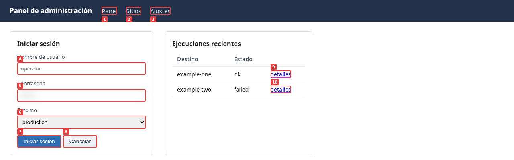

# Diwall — Manual de operación

**Versión 1.23.0 — Agosto de 2026**

*También disponible en francés, alemán y español bajo `docs/fr/`, `docs/de/` y `docs/es/`.*

Este documento responde a una pregunta: **cómo realizar la tarea X con Diwall**.

Si usted es un usuario: no se necesitan comandos. Indique a su modelo qué desea visitar, observar o lograr en un sitio web, una aplicación web o una interfaz de administración. El modelo lee este manual y traduce su intención en las acciones correctas.

Si usted es un modelo de lenguaje: estos son sus comandos. Ejecútelos directamente.

No hay descripciones arquitectónicas. Comandos que funcionan.

---

## Tabla de contenidos

1. [Verificar la instalación](#1-verificar-la-instalación)
2. [Capturar una página](#2-capturar-una-página)
3. [Navegación segura (v1.15.0)](#3-navegación-respetuosa-v1150)
4. [Directorio cifrado y credenciales](#4-directorio-cifrado-y-credenciales)
5. [Escribir y ejecutar un escenario de automatización robótica de procesos (RPA)](#5-escribe-y-ejecuta-un-escenario-de-automatización-robótica-de-procesos-rpa)
6. [Acciones: referencia completa](#6-acciones--referencia-completa)
7. [Manejar obstáculos comunes](#7-manejar-obstáculos-comunes)
8. [Monitoreo visual — watch.py](#8-monitoreo-visual--watchpy)
9. [Registro de operaciones](#9-registro-de-operaciones)
10. [Opciones de línea de comandos: referencia](#10-flags-de-la-línea-de-comandos-referencia)
11. [Códigos de salida y resultados](#11-códigos-de-salida-y-resultadosh2)

---

## 1. Verificar la instalación

```bash
# Verificación más económica posible: sin Playwright, sin URL, salida 0 inmediata (v1.18.0+).
/opt/diwall/venv/bin/python3 /opt/diwall/shot.py --version
# → {"outil": "shot.py", "version": "1.23.0"}
```

```bash
# Prueba completa con un solo comando (aproximadamente 3 segundos).
/opt/diwall/venv/bin/python3 /opt/diwall/shot.py \
  --url https://example.com --mode fast --guide-version 1.2
```

Resultado esperado: JSON en stdout con `"succes": true`.

**`--guide-version` (v1.18.0+):** `shot.py`, `rpa.py`, y `watch.py` se niegan a
ejecutarse sin él, a menos que ya exista un indicador local de una llamada aceptada anterior (`~/.config/diwall/guide_state.json`). El valor es el
`<!-- notice-version: X.Y -->` en la línea 3 de `docs/GUIDE_LLM.md` — no el
número de versión de Diwall. Lea el valor actual en lugar de confiar en cualquier valor
mencionado aquí: `grep notice-version /opt/diwall/docs/GUIDE_LLM.md`. Consulte la sección "Verificación previa obligatoria" de
`docs/GUIDE_LLM.md` para conocer el mecanismo completo y
el formato del error si lo omite.

Una vez que el marcador existe, ``--guide-version`` vuelve a ser opcional — cada otro ejemplo de comando en este manual lo omite deliberadamente, ya que un marcador de cualquier llamada anterior exitosa ya los cubre, siempre y cuando ``docs/GUIDE_LLM.md`'s `notice-version`` no haya cambiado desde entonces.

```bash
# Verifique la versión instalada.
grep "__version__" /opt/diwall/shot.py
# → __version__ = "1.23.0"

# Verificar que playwright-stealth esté disponible (v1.15.0).
/opt/diwall/venv/bin/python3 -c "import playwright_stealth; print('stealth OK')"

# Verifique que el directorio cifrado esté montado.
ls ~/Vaults/__PROJET__/Diwall/
# → debe mostrar archivos .json, no una lista vacía.
```

Si `ls ~/Vaults/...` devuelve una lista vacía o un error:
→ móntalo: `bash ~/git/Diwall/Diwall/scripts/monter-repertoire-chiffre.sh`

### 1a. Instalación desde el paquete de Debian: la opción más sencilla

El `.deb` es un recurso de lanzamiento en GitHub. Es el canal recomendado a menos que tenga la intención de modificar el propio código de Diwall, en cuyo caso consulte 1b. Los dos canales son mutuamente excluyentes en una sola máquina; ambos apuntan a `/opt/diwall/`.

```bash
sudo apt install ./diwall_1.23.0-1_all.deb
diwall-shot --version
man diwall
```

La instalación de `.deb` requiere acceso a la red (la instalación de dependencias y la descarga de Chromium ocurren durante `postinst`). Seis comandos están disponibles, cada uno una capa delgada: no hay diferencia funcional con las propias llamadas del canal "git-clone":

| Comando | Envuelve |
|---|---|
| `diwall-shot` | `shot.py` |
| `diwall-rpa` | `rpa.py` |
| `diwall-watch` | `watch.py` |
| `diwall-monter-secrets` | `scripts/monter-repertoire-chiffre.sh` |
| `diwall-demonter-secrets` | `scripts/demonter-repertoire-chiffre.sh` |
| `diwall-monitor-verifier` | `scripts/monitor-verifier.sh` |

La configuración se encuentra en una ruta diferente en este canal:
`/etc/diwall/diwall.conf` (no `/opt/diwall/diwall.conf`) — se deja un modelo
en `/etc/diwall/diwall-sample.conf`, nunca se activa automáticamente:

```bash
sudo cp /etc/diwall/diwall-sample.conf /etc/diwall/diwall.conf
sudo nano /etc/diwall/diwall.conf
sudo usermod -aG diwall $USER
```

`apt remove diwall` mantiene `/var/log/diwall/` (registro de operaciones, evidencia)
intacto; `apt purge diwall` también lo elimina. `~/Vaults/` nunca es modificado por
ninguno de los dos, en ambos canales.

**Página del manual (v1.22.0):** `man diwall` documenta los seis comandos en una
sola página. Los otros cinco nombres de comandos (`man diwall-rpa`, y así sucesivamente)
se resuelven a la misma página. Se genera a partir de `debian/diwall.1.md` durante la compilación,
por lo que no puede volverse obsoleta silenciosamente; sin embargo, para la lista exhaustiva de opciones
de cualquier comando, `--help` sigue siendo la fuente autorizada sobre la página del manual.

### 1b. Instalación desde el código fuente: para modificar Diwall en sí mismo

Use este canal solo si pretende modificar el código de Diwall: coloca el
repositorio donde `deploy.sh` puede enviar sus cambios a `/opt/diwall/`. Para
un uso corriente, el `.deb` anterior es una sola orden y hace lo mismo.

```bash
# 1. Crear usuario del sistema y directorio.
sudo useradd --system --no-create-home --shell /bin/false diwall
sudo mkdir -p /opt/diwall
sudo chown root:diwall /opt/diwall

# 2. Clona el repositorio.
git clone https://github.com/ronandavalan/diwall.git ~/git/Diwall/Diwall
cd ~/git/Diwall/Diwall

# 3. Crear un entorno virtual de Python.
sudo /usr/bin/python3 -m venv /opt/diwall/venv
sudo /opt/diwall/venv/bin/pip install -r requirements.txt

# 4. Instalar Chromium.
sudo /opt/diwall/venv/bin/playwright install chromium

# 5. Implementar / Desplegar
bash ~/git/Diwall/Diwall/scripts/deploy.sh

# 6. Cree su directorio de credenciales cifradas.
mkdir -p ~/Vaults/<your-project>/Diwall
# Cree el archivo `~/Vaults/<su-proyecto>/Diwall/<nombre_de_host>.json` con sus credenciales.
```

En este canal, la configuración es `/opt/diwall/diwall.conf`, no
`/etc/diwall/diwall.conf`. Desinstala con
`bash ~/git/Diwall/Diwall/scripts/uninstall.sh --dry-run` primero, luego sin
la bandera.

**Construcción del paquete (mantenedor):**

```bash
bash ~/git/Diwall/Diwall/scripts/construire-paquet.sh
```

Construye y luego archiva los tres artefactos (`.deb`, `.buildinfo`, `.changes`)
bajo `~/git/Diwall/paquets/<version>/`. Se conservan todas las versiones: el
`.buildinfo` es la única referencia del entorno exacto en el que se construyó un paquete, y no tiene valor si no se conserva.

---

## 2. Capturar una página

### 2a. Captura rápida: solo texto, sin imágenes PNG (aproximadamente 2 segundos)

```bash
/opt/diwall/venv/bin/python3 /opt/diwall/shot.py \
  --url https://target.local/ \
  --mode fast
```

Devuelve: `a11y_tree` (estructura de texto de la página), `boussole` (URL efectiva, título).
Úsalo cuando quieras leer el título, verificar la URL o extraer texto sin capturar una imagen PNG.

### 2b. Captura visual completa con elementos numerados

```bash
/opt/diwall/venv/bin/python3 /opt/diwall/shot.py \
  --url https://target.local/ \
  --som --a11y
```

Devuelve:
- `capture`: ruta a la imagen PNG de la página.
- `capture_som`: imagen PNG con números en los elementos interactivos (SoM).
- `elements_som`: lista JSON de elementos (id, etiqueta, texto).
- `a11y_tree`: árbol de accesibilidad.



*Lo que `--som` produce. Los números en la imagen son los valores de `id` en
`elements_som`, por lo tanto, hacer clic se vuelve `{"type": "cliquer_som", "id": 7}` — no
hay ningún selector para adivinar. Generado a partir de una versión de un componente almacenada en este repositorio
(`scenarios/interoperabilite/fixture/`); la misma figura existe en francés,
alemán y español junto con esta.*

### 2c. Lee la brújula primero

Cada salida contiene un objeto `boussole`. Léelo antes de cualquier otra cosa:

```json
"boussole": {
  "url_courante": "https://target.local/dashboard",
  "titre_page": "Dashboard — My App",
  "auth_status": "active",
  "stealth_actif": true,
  "respect": {
    "pages_visitees": 0,
    "actions_executees": 3,
    "duree_totale_ms": 2140
  }
}
```

Si `boussole.url_courante` no coincide con lo que espera: deténgase e
investigue antes de cualquier acción que modifique algo.

### 2d. Leer `etat` para tomar una decisión de "sí/no" (v1.16.0)

Cada ejecución exitosa incluye un objeto `etat` en la raíz del JSON; léalo antes de cualquier acción que lo modifique, en lugar de verificar manualmente `auth_status`, `respect.plafond_atteint`, `erreurs_js` y `erreurs_console` usted mismo:

```json
"etat": {
  "pret_a_agir": true,
  "niveau_confiance": "eleve",
  "raisons": ["aucun signal de friction détecté"]
}
```

Si `pret_a_agir` es `false`: consulte `raisons` para la causa (autenticación inactiva, desviación de sesión, límite de navegación alcanzado o un bloqueo de WAF detectado) antes de continuar.

`etat` no verifica si la URL o el contenido de la página coinciden con las expectativas de su negocio; utilice `evaluer` con `attendu`/`contient`/`motif` (sección 5d) para eso.

### 2e. `mode_conseille` — consejos de configuración previa al vuelo (v1.18.0)

Si Diwall tiene datos reales anteriores sobre el host al que llama —
procedentes de una ejecución previa de `diagnostic_dom.json` contra él —,
`etat` incluye una recomendación para su **siguiente** llamada, nunca aplicada
automáticamente:

```json
"etat": {
  "pret_a_agir": true,
  "niveau_confiance": "eleve",
  "raisons": ["mode_conseille disponible : full recommandé (React détecté sur ce host)"],
  "mode_conseille": {
    "mode": "full",
    "shadow_dom": true,
    "som_rafraichir": false,
    "raisons": ["react_detecte", "shadow_roots:3"]
  }
}
```

Obtenga estos datos para un host ejecutando el diagnóstico una sola vez:

```bash
/opt/diwall/venv/bin/python3 /opt/diwall/rpa.py \
  --scenario /opt/diwall/scenarios/diagnostic_dom.json \
  --url https://target.local/ --mode fast
```

No hay un diagnóstico previo para este host → `mode_conseille` está ausente, nunca se hace una suposición. Detalles completos en `GUIDE_LLM_MONITORING.md`.

---

## 3. Navegación Respetuosa (v1.15.0)

### 3a. Modo sigiloso `--stealth`

Algunos sitios bloquean los navegadores sin interfaz gráfica en `navigator.webdriver=true`
sin examinar la intención. `--stealth` elimina este marcador técnico automático.

```bash
# directo shot.py
/opt/diwall/venv/bin/python3 /opt/diwall/shot.py \
  --url https://target.local/ \
  --som --stealth

# Vía rpa.py
/opt/diwall/venv/bin/python3 /opt/diwall/rpa.py \
  --scenario /opt/diwall/scenarios/my-scenario.json \
  --stealth
```

Cuando está activo: `boussole.stealth_actif = true` en la salida JSON.

**Lo que cambia `--stealth`:** se elimina `navigator.webdriver`, se normalizan plugins/languages/platform.
**Lo que `--stealth` no cambia:** la IP del operador, su identidad ni su intención de navegación.

### 3b. Retrasos por cortesía

Configurado en `/opt/diwall/diwall.conf`:

```json
{
  "secrets_dir": "~/Vaults/__PROJET__/Diwall",
  "navigation": {
    "min_action_delay_ms": 800,
    "max_pages_par_run": 10,
    "max_actions_par_run": 30
  }
}
```

`min_action_delay_ms`: tiempo de retardo mínimo (ms) entre cada acción. Enviado.
valor predeterminado: 800 ms.

Desarrollo local: establezca el valor en `0` (v1.19.0): los 800 ms por defecto protegen a un operador distraído durante su *primera ejecución, sin configuración*, contra la conexión a Internet pública; esto no tiene ningún propósito de protección con respecto a su propia máquina de desarrollo/producción, donde nada se espera que se comporte de cierta manera. Establezca la clave explícitamente en su archivo local `diwall.conf`:

```json
{
  "navigation": {
    "min_action_delay_ms": 0
  }
}
```

Mantenga el valor predeterminado de 800 ms (o auméntelo) para cualquier objetivo alcanzado a través de Internet pública. El valor siempre es una elección consciente asociada al objetivo, no una propiedad fija de la herramienta; consulte la guía sobre WAF y técnicas de ocultamiento en `docs/GUIDE_LLM.md` para ver el mismo principio aplicado al comportamiento de bloqueo.

Los límites `max_pages_par_run` y `max_actions_par_run` detienen limpiamente la ejecución
si se exceden. No hay excepción: el JSON de salida contendrá:

```json
"respect": {
  "pages_visitees": 10,
  "actions_executees": 10,
  "duree_totale_ms": 12400,
  "plafond_atteint": "max_pages_par_run"
}
```

### 3c. Métricas de impacto

Cada ejecución devuelve `respect` (en la raíz del JSON y dentro de boussole):

| Clave | Significado |
|---|---|
| `pages_visitees` | Número de navegaciones `type: naviguer` ejecutadas |
| `actions_executees` | Número total de acciones del escenario ejecutadas |
| `duree_totale_ms` | Duración total de la ejecución |
| `plafond_atteint` | `"max_pages_par_run"` o `"max_actions_par_run"` si hubo parada anticipada |

### 3d. Prueba de rendimiento "Stealth" - cuantitativa (v1.17.1)

Prefiera contar señales concretas de la huella digital en lugar de comparar capturas de pantalla a simple vista; este es el método utilizado para verificar la compatibilidad de la API v1.17.0 `playwright-stealth`.
Corrección de compatibilidad de la API (`docs/RETOUR_EXPERIENCE.md` FR-79):

```bash
# Sin sigilo.
/opt/diwall/venv/bin/python3 /opt/diwall/shot.py \
  --url https://bot.sannysoft.com --no-capture --timeout 20000 \
  --actions '[{"type":"evaluer","script":"navigator.webdriver"},
               {"type":"evaluer","script":"document.querySelectorAll(\"td.failed\").length"},
               {"type":"evaluer","script":"document.querySelectorAll(\"td.passed\").length"}]'

# Con sigilo.
/opt/diwall/venv/bin/python3 /opt/diwall/shot.py \
  --url https://bot.sannysoft.com --no-capture --stealth --timeout 20000 \
  --actions '[{"type":"evaluer","script":"navigator.webdriver"},
               {"type":"evaluer","script":"document.querySelectorAll(\"td.failed\").length"},
               {"type":"evaluer","script":"document.querySelectorAll(\"td.passed\").length"}]'
```

Lea los tres valores de `evaluations[].valeur`: `navigator.webdriver` debe
pasar de `true` a `false`, y `td.failed` debe tender a `0`. Medición de
referencia (corrección v1.17.0, sesión 47): 12 failed → 0 failed.

Para una segunda opinión cualitativa, el escenario proporcionado aún genera
capturas de pantalla para su inspección:

```bash
/opt/diwall/venv/bin/python3 /opt/diwall/rpa.py \
  --scenario /opt/diwall/scenarios/test_stealth.json \
  --output-dir /tmp/diwall/stealth_with --stealth
```

`capture_sannysoft_*.png` y `capture_intoli_*.png` se guardan en ese directorio.
Nota: ambas páginas de destino discuten la detección de bots en su propio contenido, lo que
puede activar `respect.waf_bloquants` como un falso positivo (sección 3e) —
esto es esperado en esta prueba específica, no una señal de un bloqueo real.

### 3e. Señal de detección de WAF (versión 1.16.0, refinada en la versión 1.17.2)

Diwall detecta una posible obstrucción de un WAF de forma pasiva: HTTP 403/429, o una coincidencia de título/palabra clave en HTML (`Cloudflare`, `CAPTCHA`, `checking your browser`, etc.). Esto es una señal, nunca una excepción; la ejecución se completa normalmente:

```json
"respect": {
  "waf_bloquants": 1
}
```

Cuando estén presentes y `> 0`: `etat.niveau_confiance` es `"faible"` y
`etat.pret_a_agir` es `false`. Usted decide si intenta de nuevo con
`--stealth`, cambia el objetivo o se detiene; Diwall no interrumpe la ejecución por usted.

Desde la versión v1.17.2, los nombres genéricos de proveedores (`Cloudflare`, `Akamai`) solo coinciden con el título de la página; anteriormente, coincidencias incorrectas se producían en referencias ordinarias a recursos de CDN. Si persiste una coincidencia incorrecta, `--ignorer-waf` degrada `niveau_confiance` sin forzar `pret_a_agir: false`
(`boussole.waf_ignore_actif: true` registra la anulación).
La detección se basa en palabras clave y puede producir coincidencias incorrectas en páginas que legítimamente discuten el bloqueo/detección (por ejemplo, una página de referencia para la detección de bots); considérela como una señal rápida, no como un veredicto definitivo.

---

## 4. Directorio cifrado y credenciales

### 4a. Estructura

Las credenciales se encuentran en un directorio cifrado: un volumen gocryptfs, que contiene un archivo `.json` por dominio.

```
~/Vaults/__PROJET__/Diwall/
  ├── app.example.com.json         ← credentials for https://app.example.com/
  ├── admin.example.com.json       ← credentials for https://admin.example.com/
  └── operations.jsonl             ← operation log (v1.15.0)
```

Formato del archivo de credenciales:

```json
{
  "username": "admin@example.com",
  "password": "my-password"
}
```

El nombre del archivo = `urlparse(url).hostname`. Para `https://app.example.com/login/`, crear `app.example.com.json`.

### 4b. Rellenar un formulario: la regla absoluta

**PELIGRO — expone la contraseña en el shell y `/proc`**:

```bash
PASS=$(jq -r '.password' ~/Vaults/.../file.json)   # NEVER
curl -d "password=$PASS" https://...                 # NEVER
```

**CORRECTO: las credenciales se resuelven dentro de Playwright.**

```json
{"type": "remplir_som", "id": 2, "valeur": "depuis_secrets", "secret_cle": "username"},
{"type": "remplir_som", "id": 3, "valeur": "depuis_secrets", "secret_cle": "password"}
```

Los valores nunca pasan por la línea de comandos, el historial de Bash, los registros de procesos ni ningún archivo.

### 4c. Elegir el archivo de credenciales para una ejecución

```bash
# Directorio de credenciales predeterminadas (definido en diwall.conf > secrets_dir).
/opt/diwall/venv/bin/python3 /opt/diwall/shot.py --url https://target.local/ --som

# Archivo de credenciales explícito (--secrets).
/opt/diwall/venv/bin/python3 /opt/diwall/shot.py \
  --url https://target.local/ --som \
  --secrets /path/to/mounted/directory/creds.json

# Directorio de credenciales específico para cada proyecto a través de .diwall.conf.
export DIWALL_CONF=~/git/MyProject/.diwall.conf
/opt/diwall/venv/bin/python3 /opt/diwall/shot.py --url https://target.local/ --som
```

**Contenido del archivo `--secrets` — `origines_autorisees` obligatorio desde el
05/08/2026** (cambio disruptivo, sin período de compatibilidad): un archivo sin esta clave se rechaza antes de cualquier lectura.

```json
{"username": "operator", "password": "secret", "origines_autorisees": ["target.local"]}
```

`origines_autorisees` enumera los nombres de host contra los cuales este archivo puede ser utilizado.
El formato es el mismo que en `domaine_depuis_url()`: minúsculas, sin esquema y sin puerto. Una lectura
contra una página cuyo dominio no está en la lista será rechazada
(`SecretsOrigineNonAutoriseeError`).

Contenido de `~/git/MyProject/.diwall.conf`:

```json
{"secrets_dir": "../MyProject-secrets"}
```

La ruta se resuelve en relación con la ubicación de `.diwall.conf`.

### 4d. TOTP / Autenticación Multifactorial

```json
{"type": "remplir_som", "id": 6, "valeur": "depuis_secrets_totp"}
```

Lee la clave `totp_cle` (semilla base32) del archivo de credenciales y genera el código TOTP actual.

Para recibir el código a través de ntfy (flujo de trabajo sin intervención humana):

```json
{"type": "attendre_mfa_ntfy", "id_som": 6, "timeout": 120}
```

### 4e. Suma de comprobación de integridad (opcional, v1.15.0)

Para proteger un archivo de credenciales contra la corrupción silenciosa de FUSE, agregue un campo `checksum`:

```bash
# Genera el valor de suma de verificación.
/opt/diwall/venv/bin/python3 -c "
import json, hashlib
creds = json.load(open('my_credentials.json'))
fields = {k: creds[k] for k in sorted(['username','password']) if k in creds}
print('sha256:' + hashlib.sha256(json.dumps(fields, sort_keys=True).encode()).hexdigest())
"
```

Agregue el valor devuelto al archivo de credenciales:

```json
{
  "username": "admin@example.com",
  "password": "my-password",
  "checksum": "sha256:a3f2c1..."
}
```

Si la suma de control no coincide, `shot.py` lanza `SecretsChecksumError` (exit 42) con un mensaje explícito.
Sin la clave `checksum`: comportamiento sin cambios (opt-in estricto).

### 4f. Directorio cifrado cerrado: ¿qué hacer?

```
SecretsFermesError: Le répertoire chiffré Diwall est initialisé mais non monté.
```

```bash
# Monte el directorio cifrado.
bash ~/git/Diwall/Diwall/scripts/monter-repertoire-chiffre.sh

# Verifique el montaje.
ls ~/Vaults/__PROJET__/Diwall/
# → debe mostrar archivos JSON
```

### 4g. Autenticación básica de HTTP — `--http-credentials` (v1.21.0)

Para los objetivos que se encuentran detrás de un desafío de autenticación HTTP Basic (RFC 7617) a nivel de red:
un "firewall" que un proxy inverso como Caddy, nginx o Traefik presenta antes de que se renderice cualquier página, común frente a interfaces de administración alojadas internamente. Este es un mecanismo diferente al de la autenticación basada en formularios descrito anteriormente (4a-4f), el cual sigue estando totalmente soportado y no se ve afectado.

```bash
/opt/diwall/venv/bin/python3 /opt/diwall/shot.py \
  --url https://internal.example/ \
  --http-credentials --secrets ~/Vaults/__PROJET__/Diwall/internal_example.json
```

Archivo de credenciales: el par simple `username`/`password` ya utilizado para el caso común (un único conjunto de credenciales para el destino):

```json
{"username": "admin", "password": "my-password"}
```

Las claves dedicadas `http_username`/`http_password` se prueban primero y solo son necesarias cuando el mismo destino tiene tanto una barrera de autenticación básica a nivel de red como su propio inicio de sesión de aplicación separado (dos pares de credenciales diferentes en el mismo archivo). Diwall recurre automáticamente a `username`/`password` cuando las claves dedicadas no están presentes.

Confirmado en producción contra un objetivo real protegido por Caddy: la configuración
predeterminada (`send: "unauthorized"` — las credenciales se envían solo después de un
401 genuino, nunca preventivamente) resolvió el desafío en el primer intento.
`boussole.http_credentials_actif: true` confirma un éxito real, no solo que
se haya pasado la bandera; `boussole.http_auth_requise: true` distingue claramente entre un 401 sin resolver y un bloqueo de WAF.

---

## 5. Escriba y ejecute un escenario de automatización robótica de procesos (RPA)

### 5a. Protocolo de 3 pasos

**Paso 1: Explorar la página (solo lectura)**

```bash
# Vista rápida
/opt/diwall/venv/bin/python3 /opt/diwall/shot.py \
  --url https://target.local/ --mode fast

# Vista completa con elementos numerados.
/opt/diwall/venv/bin/python3 /opt/diwall/shot.py \
  --url https://target.local/ --som --a11y

# Aplicación de Componentes Web (Angular, Lit, Stencil).
/opt/diwall/venv/bin/python3 /opt/diwall/shot.py \
  --url https://target.local/ --som --a11y --shadow-dom

# Inventario enriquecido del DOM (frameworks, shadow roots, atributos de datos estables).
/opt/diwall/venv/bin/python3 /opt/diwall/rpa.py \
  --scenario /opt/diwall/scenarios/diagnostic_dom.json \
  --url https://target.local/ --mode fast
```

**Qué anotar:**
- Los identificadores SoM de los campos y los botones (leer `capture_som`)
- Los atributos estables: `name`, `id`, `aria-label`, `data-testid`
- Las superposiciones bloqueantes (avisos de cookies, ventanas modales)
- SPA o recarga HTTP completa

**Paso 2: Escriba el escenario.**

```json
{
  "nom": "login_app",
  "url": "https://app.example.com/login/",
  "intention": "Administrator login with stored credentials",
  "actions": [
    {"type": "nettoyer_overlay", "selecteur": ".cookie-banner"},
    {"type": "remplir_som", "id": 1, "valeur": "depuis_secrets", "secret_cle": "username"},
    {"type": "remplir_som", "id": 2, "valeur": "depuis_secrets", "secret_cle": "password"},
    {"type": "cliquer_som", "id": 3},
    {"type": "attendre_selecteur_present", "selecteur": ".user-avatar"},
    {"type": "capturer", "nom": "after-login"}
  ]
}
```

**Paso 3: Ejecutar**

```bash
/opt/diwall/venv/bin/python3 /opt/diwall/rpa.py \
  --scenario /opt/diwall/scenarios/login_app.json --som
```

### 5b. Escenario completo: iniciar sesión y navegar entre páginas

```json
{
  "nom": "audit_pages",
  "url": "https://app.example.com/login/",
  "intention": "Visual audit after deployment",
  "actions": [
    {"type": "remplir_som", "id": 1, "valeur": "depuis_secrets", "secret_cle": "username"},
    {"type": "remplir_som", "id": 2, "valeur": "depuis_secrets", "secret_cle": "password"},
    {"type": "cliquer_som", "id": 3},
    {"type": "attendre_selecteur_present", "selecteur": ".dashboard-main"},
    {"type": "capturer", "nom": "dashboard"},
    {"type": "naviguer", "url": "https://app.example.com/settings/"},
    {"type": "attendre_navigation"},
    {"type": "capturer", "nom": "settings"},
    {"type": "naviguer", "url": "https://app.example.com/users/"},
    {"type": "attendre_navigation"},
    {"type": "capturer", "nom": "users"}
  ]
}
```

### 5c. Extraer datos del DOM

```json
{
  "nom": "extract_counters",
  "url": "https://app.example.com/dashboard/",
  "actions": [
    {"type": "evaluer", "script": "document.title"},
    {"type": "evaluer", "script": "document.querySelectorAll('.user-row').length"},
    {"type": "evaluer", "script": "window.location.href"}
  ]
}
```

Resultado en `evaluations[]`:

```json
"evaluations": [
  {"index": 0, "script": "document.title", "valeur": "Dashboard — My App"},
  {"index": 1, "script": "...", "valeur": 42},
  {"index": 2, "script": "...", "valeur": "https://app.example.com/dashboard/"}
]
```

### 5d. Afirmaciones sobre evaluer (rpa.py solamente)

Tres claves mutuamente excluyentes, una por cada acción:

```json
{"type": "evaluer", "script": "document.querySelectorAll('.row').length", "attendu": 3}
{"type": "evaluer", "script": "document.title", "contient": "Dashboard"}
{"type": "evaluer", "script": "window.location.href", "motif": "/dashboard$"}
```

| Clave | Comparación | Tipos válidos |
|---|---|---|
| `attendu` | igualdad estricta `==` | str, int, bool |
| `contient` | subcadena `in` | solo str |
| `motif` | `re.search()` de Python | solo str |

Si la aserción falla: rpa.py se detiene de inmediato (exit 1) antes de cualquier acción posterior que modifique algo.

### 5e. Subescenarios (declencher_scenario)

Define un inicio de sesión como un subescenario reutilizable:

```json
{
  "nom": "login_app",
  "url": "https://app.example.com/login/",
  "actions": [
    {"type": "remplir_som", "id": 1, "valeur": "depuis_secrets", "secret_cle": "username"},
    {"type": "remplir_som", "id": 2, "valeur": "depuis_secrets", "secret_cle": "password"},
    {"type": "cliquer_som", "id": 3},
    {"type": "attendre_selecteur_present", "selecteur": ".user-avatar"}
  ]
}
```

Llama a este subescenario desde otro escenario:

```json
{
  "nom": "full_audit",
  "url": "https://app.example.com/login/",
  "actions": [
    {"type": "declencher_scenario", "scenario": "login_app"},
    {"type": "naviguer", "url": "https://app.example.com/report/"},
    {"type": "capturer", "nom": "report"}
  ]
}
```

Profundidad máxima: 5 niveles de anidamiento.

### 5f. Verificar que la página es la correcta antes de cualquier modificación

Siempre agrega una protección como la primera acción en los escenarios que eliminan o modifican:

```json
{"type": "evaluer", "script": "window.location.href", "contient": "/dashboard"},
{"type": "evaluer", "script": "document.querySelector('.alert-danger')?.textContent ?? null", "attendu": null}
```

Si la protección falla: rpa.py se detiene antes de que se ejecute la eliminación.

### 5g. Reanudar una sesión (cookies persistentes)

```bash
# Primera invocación: autenticar y guardar la sesión.
/opt/diwall/venv/bin/python3 /opt/diwall/shot.py \
  --url https://app.example.com/login/ \
  --actions /tmp/login.json \
  --sauver-session /tmp/diwall/session.json \
  --som

# Invocaciones posteriores: reutilizar la sesión (sin volver a iniciar sesión).
/opt/diwall/venv/bin/python3 /opt/diwall/shot.py \
  --url https://app.example.com/dashboard/ \
  --reprendre-session /tmp/diwall/session.json \
  --som
```

**Señal de desviación de sesión:** si la sesión ha expirado, poner `boussole.session_derive: true` en el JSON.
En ese caso: reiniciar el inicio de sesión completo sin `--reprendre-session`.

### 5h. Estabilidad estructural sin cambios visuales a nivel de píxel — `--replay-verifier` (v1.17.0)

```bash
# Primera ejecución: guardar la referencia estructural.
/opt/diwall/venv/bin/python3 /opt/diwall/rpa.py \
  --scenario /opt/diwall/scenarios/dashboard.json \
  --sauver-verifier-reference /tmp/dashboard.ref.json

# Ejecuciones posteriores — comparar.
/opt/diwall/venv/bin/python3 /opt/diwall/rpa.py \
  --scenario /opt/diwall/scenarios/dashboard.json \
  --replay-verifier /tmp/dashboard.ref.json
```

Compara los resultados de `http_status`, `dom_stats`, `evaluer`, y el número de elementos de SoM (no contenido) con la referencia guardada. Verificación en stderr:

```json
{"type_comparaison": "replay_verifier", "verdict": "stable", "diffs": []}
```

Exit 1 con `verdict: "regression"`, donde `diffs` enumera cada campo
divergente (`reference` frente a `obtenu`). Las dos opciones son mutuamente
excluyentes.

### 5i. Reanudar un escenario largo después de una falla — `--checkpoint` (v1.17.0)

```bash
/opt/diwall/venv/bin/python3 /opt/diwall/rpa.py \
  --scenario /opt/diwall/scenarios/long_audit.json \
  --checkpoint /tmp/long_audit.checkpoint.json
```

Si el escenario falla a mitad de camino, se escribe
`/tmp/long_audit.checkpoint.json` con el número de acciones completadas y un
archivo de sesión. **Vuelva a lanzar exactamente la misma orden** para
retomarlo: las acciones ya completadas se omiten. Si todo termina con éxito, el
archivo de checkpoint se elimina automáticamente.

Una ejecución interrumpida por un límite de navegación (`max_actions_par_run`/`max_pages_par_run`)
se trata de la misma manera que una falla parcial desde la versión v1.17.2: el punto de control
se actualiza con el progreso real, no se elimina. Antes de la versión v1.17.2, también se
eliminaba en este caso (devuelve la misma señal `succes: true` que un tramo
completado por completo), perdiendo silenciosamente todo el progreso restante en escenarios largos.

El estado del DOM (modales abiertos, formularios parcialmente completados) nunca se guarda al reanudar una sesión; solo se guardan las cookies/`localStorage` y la posición en la lista de acciones. No confíe en `--checkpoint` para continuar un formulario de varios pasos a mitad de proceso; este solo permite la continuación en los límites de acción.

### 5j. Elementos objetivo dentro de un iframe (v1.17.0)

No se aplica numeración de "Set-of-Mark" dentro de un `<iframe>` (ya sea del mismo origen o de otro origen). En su lugar, selecciónelo directamente mediante un selector CSS:

```json
{"type": "cliquer_iframe", "iframe_selecteur": "iframe#paiement", "selecteur": "button.valider"},
{"type": "remplir_iframe", "iframe_selecteur": "iframe#paiement", "selecteur": "input[name=cvv]", "valeur": "depuis_secrets", "secret_cle": "cvv"}
```

`remplir_iframe` soporta `valeur: "depuis_secrets"` exactamente como `remplir`.
(sección 4b) — nunca se utiliza una credencial en texto plano en este escenario. Si el elemento de destino rechaza la interacción (por ejemplo, un área `contenteditable` en estado de solo lectura), agregue `"force": true` a `cliquer_iframe` — con la misma semántica que `cliquer`.
(sección 7e).

Para encontrar el selector interno: utilice `evaluer` en el contenido del iframe si es del mismo origen (`document.querySelector('iframe').contentDocument...`), o consulte la propia estructura de marcado/documentación de la aplicación destino si es de un origen diferente.

### 5k. Iframes anidados — `iframe_chemin` (v1.18.0)

Un iframe dentro de otro iframe: reemplazar `iframe_selecteur` con `iframe_chemin`, un arreglo ordenado: un selector CSS por cada nivel de anidamiento, desde el más externo hasta el más interno.

```json
{"type": "cliquer_iframe", "iframe_chemin": ["iframe#wrapper", "iframe#paiement"], "selecteur": "button.valider"},
{"type": "remplir_iframe", "iframe_chemin": ["iframe#wrapper", "iframe#paiement"], "selecteur": "input[name=cvv]", "valeur": "depuis_secrets", "secret_cle": "cvv"}
```

`iframe_selecteur` (marco único) y `iframe_chemin` (descenso anidado) son
mutuamente excluyentes; se requiere exactamente uno por acción. Para un iframe de un solo nivel, continúe utilizando `iframe_selecteur` (sección 5j).

---

## 6. Acciones — referencia completa

| Type | Required params | Optional params | Notes |
|---|---|---|---|
| `naviguer` | `url` | — | Recarga completa de HTTP. Contabilizado en `respect.pages_visitees` |
| `cliquer` | `selecteur` | `force` (bool), `repli_js` (bool) | `force: true` omite elementos ocultos por CSS o muestra un modal. `repli_js: true` reintenta a través de JS si el clic nativo aún falla (v1.22.0) — requiere que `--no-evaluer` esté desactivado |
| `cliquer_som` | `id` | — | Clic en las coordenadas centrales del elemento. No se necesita `force` |
| `cliquer_visuel` | `description` | — | Visión de LLM (~32 s). Último recurso para canvas o elementos sin atributos |
| `remplir` | `selecteur`, `valeur` | `secret_cle` | `valeur: "depuis_secrets"` resuelve la credencial almacenada |
| `remplir_som` | `id`, `valeur` | `secret_cle` | Limpia el campo antes de escribir. `valeur: "depuis_secrets_totp"` para TOTP |
| `capturer` | `nom` | `som` (bool) | PNG intermedio con nombre. `som: true` para una captura anotada |
| `evaluer` | `script` | `attendu`, `contient`, `motif` | JS ejecutado en el navegador. Asertos solo para rpa.py |
| `defiler` | `px` or `selecteur` | — | Desplazamiento vertical en píxeles (`px`) o desplazamiento al elemento (`selecteur`) |
| `pause` | `ms` | `interval_capture` | Retraso fijo en ms. Prefiera `attendre_selecteur_present` para señales de DOM |
| `attendre` | `selecteur` | `interval_capture` | Espera a que un selector CSS esté presente |
| `attendre_navigation` | — | — | Espera a que finalicen las solicitudes de red (`networkidle`) |
| `attendre_url` | `motif` | `attendre_changement` (bool) | La URL contiene un patrón (coincidencia parcial). `attendre_changement: true` si la URL actual ya contiene el patrón |
| `attendre_selecteur_present` | `selecteur` | — | Espera a que el elemento sea visible (state=visible) |
| `attendre_absence` | `selecteur` | `delai_initial_ms` | Espera a que se elimine el elemento del DOM (state=detached) |
| `attendre_reseau_calme` | — | `timeout_ms` | 500 ms de silencio de red. `timeout_ms`: duración máxima antes de desistir |
| `attendre_mfa_ntfy` | `id_som` | `timeout` | Espera un código TOTP a través de ntfy, lo completa en el campo SoM |
| `nettoyer_overlay` | `selecteur` | — | Oculta las superposiciones que bloquean (banner de cookies, modal). Usar antes de SoM |
| `declencher_scenario` | `scenario` | — | Incluye las acciones de un sub-escenario. Profundidad máxima: 5 |
| `cliquer_iframe` | `iframe_selecteur` \| `iframe_chemin`, `selecteur` | `force` (bool) | Clic dentro de un iframe (v1.17.0). `iframe_chemin` para iframes anidados (v1.18.0, sección 5k). No se permite SoM dentro de frames |
| `remplir_iframe` | `iframe_selecteur` \| `iframe_chemin`, `selecteur`, `valeur` | `secret_cle` | Rellena dentro de un iframe (v1.17.0). `iframe_chemin` para iframes anidados (v1.18.0). `valeur: "depuis_secrets"` soportado |

---

## 7. Manejar obstáculos comunes

### 7a. Banner de cookies / superposición de bloqueo

```json
{"type": "nettoyer_overlay", "selecteur": ".cookie-consent-banner, #gdpr-overlay"}
```

Coloque **antes** de cualquier otra acción y antes de los números de SoM. La superposición oculta los elementos que tienen números de SoM.
No la utilice en escenarios `watch.py`. (La superposición forma parte de la referencia visual).

### 7b. Elemento fuera de la ventana visible

SoM advierte cuando un elemento interactivo está fuera de la pantalla:

```json
"som_hors_viewport": 3,
"avertissement_scroll": "3 interactive element(s) off-viewport — use defiler before cliquer_som"
```

```json
{"type": "defiler", "selecteur": "#the-button"},
{"type": "remplir_som", "id": 7, "valeur": "depuis_secrets", "secret_cle": "username"}
```

### 7c. Componentes web: Shadow DOM

Si los elementos interactivos visibles no reciben un número de SoM:

```bash
/opt/diwall/venv/bin/python3 /opt/diwall/shot.py \
  --url https://target.local/ --som --shadow-dom
```

O en el escenario: `"shadow_dom": true` en la raíz.

Cuándo usar: Angular, Lit, Stencil, FAST. No activar en proyectos que no utilicen Web Components.

Para acceder a un elemento dentro de un Shadow Root sin `--shadow-dom`:

```json
{"type": "evaluer", "script": "document.querySelector('my-component').shadowRoot.querySelector('button').click()"}
```

### 7d. Aplicaciones web de una sola página (SPA) (React, Vue, Angular) — navegación sin recarga

Después de un clic que cambia la vista en una aplicación SPA, Playwright no sabe cuándo se ha completado la navegación.

```json
{"type": "cliquer_som", "id": 5},
{"type": "attendre_url", "motif": "/dashboard"},
{"type": "evaluer", "script": "document.title", "contient": "Dashboard"}
```

O espere a que aparezca un elemento específico de la nueva vista:

```json
{"type": "cliquer_som", "id": 5},
{"type": "attendre_selecteur_present", "selecteur": "[data-testid='dashboard-main']"}
```

Nunca asumas que un clic ha completado la navegación sin una señal del DOM.

### 7e. Diálogo de CSS o `showModal()`

`TimeoutError` en `cliquer` cuando el elemento es visible en el DOM = elemento oculto con CSS
o dentro de un diálogo.

```json
{"type": "cliquer", "selecteur": "#dialog-confirm button[type=submit]", "force": true}
```

Si `force: true` es insuficiente (el elemento está ausente del DOM):

```json
{"type": "evaluer", "script": "document.querySelector('#dialog-confirm button[type=submit]').click()"}
```

No utilices `force` en `cliquer_som`. Es innecesario, `cliquer_som` utiliza coordenadas y evita las comprobaciones de forma nativa.

### 7f. Operación prolongada (indicador de carga, trabajo por lotes)

No use `pause` para esperar una duración fija. Espere la señal del DOM:

```json
{"type": "cliquer_som", "id": 7},
{"type": "attendre_absence", "selecteur": ".spinner", "delai_initial_ms": 500},
{"type": "attendre_selecteur_present", "selecteur": ".result-container"},
{"type": "capturer", "nom": "result"}
```

Si la operación no proporciona ninguna señal de DOM, utilice `interval_capture` para observar el estado:

```json
{"type": "pause", "ms": 30000, "interval_capture": 5}
```

Las capturas intermedias aparecen en `stream_captures[]`.

### 7g. Límite alcanzado (v1.15.0)

Si `respect.plafond_atteint` aparece en la salida, la ejecución se detuvo
antes de terminar el escenario. Las acciones restantes no se ejecutaron.

Opciones:
1. Aumentar `max_pages_par_run` o `max_actions_par_run` en `diwall.conf`
2. Dividir el escenario en múltiples ejecuciones
3. Anular los límites máximos en el archivo JSON del escenario (esto se documentará en _CADRE).

### 7h. `<select>` campo de formulario

`remplir` no funciona en `<select>`. Utilice `remplir_som` con el ID de SoM de la `<select>`.

### 7i. Identificadores de SoM inválidos en la siguiente ejecución

Los ID de SoM se recalculan en cada captura. No persisten entre ejecuciones.
Siempre vuelva a ejecutar `shot.py --som` para obtener los ID de la ejecución actual.
Después de un `defiler` o al abrir una ventana emergente: vuelva a ejecutar `shot.py --som`.

### 7j. Desfase del ID de SoM en páginas altamente dinámicas — `--som-rafraichir` (v1.17.0)

Por defecto, `cliquer_som`/`remplir_som` resuelven `id: N` reindexando el DOM activo en el momento del clic; si un elemento aparece o desaparece **antes** de su objetivo en el orden del DOM entre la captura de `--som` y el clic (por ejemplo, un banner de cookies que se cierra, una ventana modal que se abre), `id: N` puede resolver silenciosamente a un elemento **diferente** al que se muestra con el número N en la captura de pantalla.

```bash
/opt/diwall/venv/bin/python3 /opt/diwall/shot.py \
  --url https://target.local/ --som --som-rafraichir \
  --actions '[{"type":"cliquer_som","id":5}]'
```

Con esta bandera, cada elemento numerado se marca en el momento de la captura y se resuelve
mediante esa marca en lugar de reindexarse; si el elemento exacto fue eliminado, obtendrá un error explícito de "elemento SoM no encontrado" en lugar de un clic en un objetivo incorrecto. `boussole.som_rafraichir_actif: true` cuando está activa. Recomendado en
páginas con cambios frecuentes en el DOM entre la captura y la acción; no tiene efecto en el comportamiento predeterminado cuando no se especifica.

Desde la versión v1.17.2, el injector también elimina los marcadores dejados por una captura anterior `--som` en la misma página antes de volver a numerar; sin esto, un elemento oculto o desplazado entre dos capturas podría mantener un marcador obsoleto `data-dw-som-id`, lo que provocaría una colisión con un elemento recién numerado y daría como resultado el elemento incorrecto.

### 7k. Sitio bloqueado por el WAF (error 403 inmediato)

```bash
# Intenta con sigilo.
/opt/diwall/venv/bin/python3 /opt/diwall/shot.py \
  --url https://target.local/ --mode fast --stealth
```

Si el error 403 persiste con `--stealth`: el sitio utiliza huellas digitales TLS (JA3/JA4) o análisis de comportamiento avanzado (Cloudflare Enterprise). `playwright-stealth` no evita estas protecciones.
Consulte `docs/RETOUR_EXPERIENCE.md` FR-77/FR-78/FR-79 para obtener más información.

Diwall también indica de forma pasiva una posible obstrucción sin que usted tenga que verificar el estado HTTP directamente; consulte la sección 3e (`respect.waf_bloquants`).

### 7l. La navegación inicial nunca se completa — `--wait-until` (v1.22.0)

Síntoma: `TimeoutError` en la navegación inicial, y aumentar `--timeout`
no cambia nada (45 s falla exactamente como 10 s). Causa: por defecto Diwall espera
a `networkidle` — 500 ms de silencio de red. Una página que realiza consultas continuamente
(estadísticas en tiempo real, contadores de actualización automática, paneles de administración del router) nunca
produce ese silencio, así que ningún valor de tiempo de espera puede ser lo suficientemente grande.

```bash
# shot.py — reconocimiento directo
/opt/diwall/venv/bin/python3 /opt/diwall/shot.py \
  --url http://target.local/ --wait-until load --som --a11y --guide-version 1.2

# rpa.py — se propagó a shot.py, por lo que los escenarios alcanzan los mismos objetivos.
/opt/diwall/venv/bin/python3 /opt/diwall/rpa.py \
  --scenario ./admin_login.json --wait-until load --guide-version 1.2
```

Un escenario puede incluirlo como una propiedad raíz, permaneciendo así autocontenido:

```json
{"url": "http://target.local/", "wait_until": "load", "actions": [...]}
```

La opción de línea de comandos tiene prioridad sobre la propiedad del escenario.

| Valor | Espera por | Úselo cuando |
|---|---|---|
| `networkidle` | 500 ms de silencio en la red | predeterminado; manténgalo a menos que falle |
| `load` | evento `load` (página y subrecursos) | sondeo continuo / estadísticas en tiempo real |
| `domcontentloaded` | HTML analizado, los subrecursos aún están pendientes | página muy pesada, solo necesita el DOM |

Se aplica solo a la navegación inicial; la acción `naviguer` no se ve afectada.
`boussole.wait_until` informa el valor solo cuando es diferente del valor predeterminado.

---

## 8. Monitoreo visual — watch.py

### 8a. Guardar una referencia

```bash
/opt/diwall/venv/bin/python3 /opt/diwall/watch.py \
  --url https://target.local/status \
  --sauver-reference \
  --nom home
```

La referencia se guarda en `/opt/diwall/references/`.

### 8b. Comparar con la referencia (diferencia de píxeles)

```bash
/opt/diwall/venv/bin/python3 /opt/diwall/watch.py \
  --url https://target.local/status \
  --comparer-pixel /opt/diwall/references/target.local_home/reference.png \
  --nom home
```

Veredictos:

| `taux_diff` | Veredicto | Código de salida |
|---|---|---|
| < 0.2% | `stable` | 0 |
| 0.2% – 5% | `drift` | 0 |
| ≥ 5% | `regression` | 1 |
| Dimensiones diferentes | `viewport_mismatch` | 2 |

### 8c. Comparación semántica (modelo de lenguaje grande)

```bash
/opt/diwall/venv/bin/python3 /opt/diwall/watch.py \
  --url https://target.local/status \
  --comparer \
  --llm local
```

Combina el análisis de diferencias de píxeles con el análisis de modelos de lenguaje grandes (LLM):

```bash
--llm-en-complement   # LLM only if pixel verdict is drift or regression
```

### 8d. Ignorar una zona animada

```bash
/opt/diwall/venv/bin/python3 /opt/diwall/watch.py \
  --url https://target.local/status \
  --comparer-pixel reference.png \
  --exclure-zone 100,200,300,50    # X,Y,Width,Height in pixels
```

### 8e. Bucle de monitoreo

```bash
while true; do
  /opt/diwall/venv/bin/python3 /opt/diwall/watch.py \
    --url https://target.local/status \
    --comparer-pixel /opt/diwall/references/status-ok.png \
    --ntfy-url https://ntfy.sh/my-alerts
  sleep 60
done
```

### 8f. Cron para el monitoreo autónomo

```bash
# /etc/cron.d/diwall-monitor
*/30 * * * * diwall /opt/diwall/venv/bin/python3 /opt/diwall/watch.py \
  --url https://target.local/status \
  --comparer-pixel /opt/diwall/references/status-ok.png \
  --ntfy-url https://ntfy.sh/my-alerts \
  >> /var/log/diwall/cron.jsonl 2>&1
```

### 8g. Monitoreo estructural continuo — `monitor-verifier.sh` (v1.18.0)

Complementos 8a–8f: `watch.py` monitorea la *apariencia* (píxeles/semántica).
`scripts/monitor-verifier.sh` monitorea la *estructura* (`http_status`,
`dom_stats`, `evaluations`, conteo de SoM) — imagen nula, llamada LLM nula, construido sobre
`--no-capture` + `--replay-verifier` (sección 5h).

```bash
# Primera ejecución: crear la referencia estructural.
/opt/diwall/venv/bin/python3 /opt/diwall/rpa.py \
  --scenario /opt/diwall/scenarios/sillage_login.json \
  --sauver-verifier-reference /opt/diwall/references/sillage_login.ref.json

# Una verificación y alerta que se ejecuta periódicamente (no es un demonio), ejecútela repetidamente mediante cron.
# Los archivos `scripts/*.sh` nunca se despliegan a /opt/diwall/, por lo que se ejecutan desde el repositorio de Git.
# fuente, como si fuera su propio usuario.
bash ~/git/Diwall/Diwall/scripts/monitor-verifier.sh \
  --scenario /opt/diwall/scenarios/sillage_login.json \
  --reference /opt/diwall/references/sillage_login.ref.json \
  --ntfy-topic diwall-monitoring
```

```bash
# crontab -e (su propio archivo crontab)
*/15 * * * * bash ~/git/Diwall/Diwall/scripts/monitor-verifier.sh \
  --scenario /opt/diwall/scenarios/sillage_login.json \
  --reference /opt/diwall/references/sillage_login.ref.json \
  --ntfy-topic diwall-monitoring \
  >> /var/log/diwall/cron-structural.jsonl 2>&1
```

Estable → silencio. Regresión → una notificación `ntfy` con las diferencias. Cada
ejecución es un proceso aislado: sin demonio, sin riesgo de fuga de memoria, y
la función "Navegación Respetuosa" restablece los límites limpiamente en cada ejecución.

---

## 9. Registro de operaciones

El registro es configurable en `diwall.conf` (v1.15.0):

```json
"journal": {
  "chemin": "~/Vaults/__PROJET__/Diwall/operations.jsonl"
}
```

Si está ausente o el directorio cifrado no está montado, alternativa: variable de entorno `DIWALL_JOURNAL`, luego `/var/log/diwall/operations.jsonl`.

```bash
# Lee las últimas 10 entradas.
tail -n 10 ~/Vaults/__PROJET__/Diwall/operations.jsonl | python3 -m json.tool

# Filtra por objetivo (herramienta journal.py).
/opt/diwall/venv/bin/python3 /opt/diwall/journal.py \
  --cible app.example.com

# Filtrar solo las operaciones que modifican los datos.
/opt/diwall/venv/bin/python3 /opt/diwall/journal.py \
  --cible app.example.com --mutatif

# Desde una fecha.
/opt/diwall/venv/bin/python3 /opt/diwall/journal.py \
  --cible app.example.com --depuis 2026-07-01

# Ejecuciones fallidas únicamente (v1.20.0) — resultado != "éxito"
/opt/diwall/venv/bin/python3 /opt/diwall/journal.py \
  --cible app.example.com --erreurs
```

Campos en cada entrada:

| Campo | Significado |
|---|---|
| `ts` | Marca de tiempo ISO 8601 |
| `version` | Versión de Diwall |
| `outil` | `shot.py` o `rpa.py` |
| `cible_url` | URL de destino |
| `scenario` | Ruta del archivo de escenario (modo RPA) |
| `source_scenario` | Solo el nombre del archivo de escenario, sin ruta (v1.18.0) — activa `mode_conseille` (sección 2e) |
| `resultat` | `"succes"` o `"echec"` |
| `mutatif` | `true` si hay al menos una acción de escritura |
| `duree_ms` | Duración en ms |
| `intention` | Etiqueta pasada a través de `--intention` o el campo de escenario `intention` |

### 9a. Rotación de registros (G-36, CHANTIER_SANITISATION.md)

Diwall no incluye una configuración de logrotate — `/var/log/diwall/operations.jsonl`
crece sin límite hasta que el administrador instala una. `lib/journal.py` abre
y cierra el archivo en cada escritura (sin un descriptor de archivo persistente entre
ejecuciones), específicamente para que el comportamiento **predeterminado** de logrotate (renombrar
el archivo actual, crear uno nuevo) funcione correctamente sin ninguna opción especial: la siguiente escritura vuelve a abrir la ruta y encuentra el nuevo inode.

No agregue ``copytruncate`` a la configuración de logrotate de Diwall; es innecesario aquí (a diferencia de las herramientas que mantienen un descriptor de archivo abierto durante toda su vida útil) y reintroduce una ventana de pérdida de escritura que este diseño se diseñó para evitar. Ejemplo: ``/etc/logrotate.d/diwall``

```
/var/log/diwall/operations.jsonl {
    weekly
    rotate 8
    compress
    delaycompress
    missingok
    notifempty
    create 0640 diwall diwall
}
```

`journal.py` (el lector) ya sigue los archivos rotados de forma transparente.
(`operations.jsonl`, `.1`, `.2.gz`, ...) — no se necesita ningún paso adicional después de la rotación.

---

## 10. Flags de la línea de comandos: referencia

### shot.py

| Flag | Default | Descripción |
|---|---|---|
| `--version` | — | Imprime la versión instalada y sale inmediatamente; no se requiere Playwright ni ningún otro argumento (v1.18.0) |
| `--guide-version X.Y` | — | Prueba de lectura de `docs/GUIDE_LLM.md` — requerido a menos que ya exista un marcador local válido (v1.18.0, sección 1) |
| `--url URL` | required | URL para capturar |
| `--actions FILE` | — | Archivo JSON de acciones secuenciales |
| `--output-dir DIR` | `/tmp/diwall` | Directorio de salida PNG |
| `--timeout MS` | 10000 | Tiempo de espera por acción de Playwright (ms) |
| `--screenshot-timeout MS` | 120000 | Tiempo de espera para `page.screenshot()` (ms). Distinto de `--timeout` |
| `--largeur PX` | 1280 | Ancho del viewport |
| `--hauteur PX` | 720 | Altura del viewport |
| `--som` | off | Activa el "Set-of-Mark" (numeración de elementos) |
| `--a11y` | off | Incluye el árbol de accesibilidad en JSON |
| `--shadow-dom` | off | Recorre Shadow Roots para SoM (Angular, Lit, Stencil) |
| `--stealth` | off | Modo "stealth" de playwright-stealth (v1.15.0) |
| `--mode fast\|full` | — | `fast` = `--no-capture --a11y`. `full` = comportamiento predeterminado |
| `--no-capture` | off | Omite la captura PNG y el SoM |
| `--llm local\|claude` | `local` | Motor LLM para `cliquer_visuel` |
| `--secrets FILE` | — | Ruta explícita a un archivo de credenciales |
| `--auth-indicator SEL` | — | Selector CSS presente solo en la sesión autenticada |
| `--auth-indicator-negative SEL` | — | Selector CSS presente solo fuera de la sesión autenticada |
| `--intention TEXT` | — | Etiqueta comercial registrada en el registro |
| `--sauver-session FILE` | — | Guarda las cookies después de las acciones |
| `--reprendre-session FILE` | — | Reanuda una sesión guardada |
| `--interval-capture N` | 0 | Capturas periódicas cada N segundos durante `attendre`, `pause` |
| `--som-rafraichir` | off | Resolución estable del SoM por atributo en lugar de reindexación en vivo (v1.17.0, sección 7j) |
| `--ignorer-waf` | off | Un bloqueo WAF detectado degrada `niveau_confiance` pero ya no fuerza automáticamente `pret_a_agir: false` (v1.17.2, sección 3e) |
| `--http-credentials` | off | Resuelve las credenciales de HTTP Basic Auth del archivo de credenciales, con alcance al origen del objetivo (v1.21.0, sección 4g) |
| `--no-evaluer` | off | Rechaza la acción **evaluer** para toda la ejecución; recomendado en producción contra objetivos con formularios sensibles (v1.15.1) |
| `--no-filtre-evaluer` | off | Deshabilita la neutralización de stdout de los valores de retorno, las URL y los mensajes de error de **evaluer**; solo ejecuciones de depuración explícitas. La neutralización está habilitada por defecto; cuando se deshabilita, `boussole.filtre_evaluer_actif: false` se establece en la salida para que el operador pueda auditarla desde el propio JSON (v1.23.0) |

### rpa.py

Propaga todas las banderas relevantes de shot.py, además de:

| Flag | Descripción |
|---|---|
| `--version` | Imprime la versión instalada y sale inmediatamente (v1.18.0) |
| `--guide-version X.Y` | Prueba de lectura de `docs/GUIDE_LLM.md` — verificada independientemente, misma regla que shot.py (v1.18.0) |
| `--scenario FILE` | Ruta al escenario JSON o YAML (requerido) |
| `--url URL` | Sobreescribe la URL del escenario sin modificar el archivo |
| `--stealth` | Se propaga a shot.py |
| `--mode fast\|full` | Se propaga a shot.py |
| `--som-rafraichir` | Se propaga a shot.py (v1.17.0, sección 7j) |
| `--ignorer-waf` | Se propaga a shot.py (v1.17.2, sección 3e) |
| `--http-credentials` | Se propaga a shot.py. También se puede establecer como propiedad raíz del escenario `"http_credentials": true` (v1.21.0, sección 4g) |
| `--sauver-verifier-reference FILE` | Guarda la referencia estructural para `--replay-verifier` (v1.17.0, sección 5h) |
| `--replay-verifier FILE` | Compara la ejecución con una referencia estructural, sale con código 1 en caso de regresión (v1.17.0, sección 5h) |
| `--checkpoint FILE` | Reanuda un escenario largo después de un fallo durante la ejecución (v1.17.0, sección 5i) |

### watch.py

| Flag | Descripción |
|---|---|
| `--version` | Imprime la versión instalada y sale inmediatamente (v1.18.0) |
| `--guide-version X.Y` | Prueba de lectura de `docs/GUIDE_LLM.md` — verificada independientemente, misma regla que shot.py (v1.18.0) |
| `--url URL` | URL a monitorizar |
| `--sauver-reference` | Captura y guarda como referencia |
| `--comparer-pixel REF` | Diferencia de píxeles con respecto al archivo PNG REF |
| `--comparer` | Diferencia semántica del modelo de lenguaje (LLM) |
| `--nom NAME` | Nombre de la vista (múltiples vistas por URL) |
| `--seuil-stable F` | Umbral de `stable` (por defecto: 0.002 = 0.2%) |
| `--seuil-regression F` | Umbral de `regression` (por defecto: 0.05 = 5%) |
| `--exclure-zone X,Y,W,H` | Zona a ignorar (repetible) |
| `--heatmap` | Produce una imagen PNG de las zonas modificadas |
| `--ntfy-url URL` | Envía una alerta ntfy en caso de regresión |
| `--llm-en-complement` | Agrega la diferencia del modelo de lenguaje cuando el valor de píxel indica deriva o regresión |

---

## 11. Códigos de salida y resultados</h2>

### Códigos de salida

| Código | Causa | Qué hacer |
|---|---|---|
| 0 | Éxito | — |
| 1 | Error de Playwright, acción fallida, aserción de rpa.py | Leer `erreur` en el JSON. Ver `GUIDE_LLM_INTERACTIONS.md` |
| 1 | `guide_non_lu` — `--guide-version` ausente o incorrecto, sin marcador válido (v1.18.0) | Se dispara antes de arrancar Playwright. Leer `docs/GUIDE_LLM.md` y relanzar con `--guide-version X.Y` (sección 1) |
| 2 | `viewport_mismatch` (watch.py) | Volver a capturar la referencia con el mismo viewport |
| 3 | Módulo `playwright` no encontrado | Invocar mediante `/opt/diwall/venv/bin/python3` |
| 42 | `SecretsFermesError` — directorio cifrado no montado, o suma de control inválida | Montarlo, o verificar el archivo de credenciales |
| 43 | `SecretsNonConfigureError` — falta `diwall.conf` | `sudo cp /opt/diwall/diwall-sample.conf /opt/diwall/diwall.conf && sudo nano /opt/diwall/diwall.conf` |

### Estructura del JSON de salida

```json
{
  "succes": true,
  "http_status": 200,
  "url_finale": "https://target.local/dashboard",
  "erreurs_js": [],
  "erreurs_console": [],
  "duree_ms": 2400,
  "horodatage": "2026-07-01T12:00:00+02:00",
  "capture": "/tmp/diwall/a1b2c3d4e5f6/capture_1234567890123456789.png",
  "capture_som": "/tmp/diwall/a1b2c3d4e5f6/capture_som_1234567890123456789.png",
  "elements_som": [...],
  "a11y_tree": "...",
  "evaluations": [...],
  "latences_actions": [
    {"index": 0, "type": "naviguer", "latence_ms": 842},
    {"index": 1, "type": "cliquer_som", "latence_ms": 63}
  ],
  "respect": {
    "pages_visitees": 0,
    "actions_executees": 3,
    "duree_totale_ms": 2400,
    "indice_agressivite": 0.33
  },
  "etat": {
    "pret_a_agir": true,
    "niveau_confiance": "eleve",
    "raisons": ["aucun signal de friction détecté"]
  },
  "boussole": {
    "utilisateur": "operator",
    "ip_locale": "__IP_LAN__",
    "repertoire": "/opt/diwall",
    "operation_id": "a1b2c3d4e5f6",
    "url_courante": "https://target.local/dashboard",
    "titre_page": "Dashboard — My App",
    "stealth_actif": true,
    "shadow_dom_actif": true,
    "som_rafraichir_actif": true,
    "auth_status": "active",
    "som_hors_viewport": 0,
    "respect": { "pages_visitees": 0, "actions_executees": 3, "duree_totale_ms": 2400, "indice_agressivite": 0.33 }
  },
  "diwall_meta": {
    "version_shot": "1.23.0",
    "profil": "operator",
    "modeles_appeles": []
  }
}
```

`operation_id` (v1.16.0) siempre está presente e identifica esta ejecución de forma única:
indica el directorio de aislamiento que se encuentra en `/tmp/diwall/<operation_id>/` y
coincide con el campo `operation_id` de la entrada de esta ejecución en el registro de operaciones
(sección 9). `etat` (v1.16.0) solo está presente en la ruta de éxito.
`latences_actions` (v1.20.0) siempre está presente (lista vacía si no hay acciones),
una entrada por cada acción que se ejecutó realmente; consulta `GUIDE_LLM_MONITORING.md`
para ver cómo complementa a `respect.duree_totale_ms`.

Claves condicionales (ausentes cuando está inactivo): `capture`, `capture_som`, `elements_som`, `a11y_tree`,
`evaluations`, `auth_status`, `stealth_actif`, `shadow_dom_actif`, `som_rafraichir_actif`,
`som_hors_viewport`, `session_derive`, `respect.plafond_atteint`, `respect.waf_bloquants`,
`respect.indice_agressivite` (presente siempre que al menos una acción se haya ejecutado),
`actions_executees_avant_echec`, `pages_visitees_avant_echec` (solo en el JSON de error, v1.17.0),
`etat.mode_conseille` (presente solo con datos previos reales `diagnostic_dom.json` para este host, v1.18.0, sección 2e).

### Error — formato

```json
{
  "succes": false,
  "erreur": "secrets_fermes",
  "message": "Le répertoire chiffré Diwall est initialisé mais non monté.",
  "code_sortie_recommande": 42,
  "boussole": { "url_courante": "", "titre_page": "" }
}
```

---

## Rutas de referencia

| Path | Role |
|---|---|
| `/opt/diwall/` | Instalación de producción |
| `/opt/diwall/venv/bin/python3` | Python a utilizar en cada ejecución |
| `/opt/diwall/diwall.conf` | Configuración de la máquina (credenciales, navegación, registro) |
| `/opt/diwall/diwall-sample.conf` | Plantilla de configuración |
| `/opt/diwall/scenarios/` | Escenarios de RPA |
| `/opt/diwall/docs/` | Documentación |
| `/opt/diwall/references/` | Referencias visuales watch.py |
| `/tmp/diwall/<operation_id>/` | Capturas temporales para una ejecución, aisladas por `operation_id` (v1.16.0, se borran al reiniciar) |
| `~/Vaults/__PROJET__/Diwall/` | Credenciales + registro (volumen gocryptfs) |
| `~/git/Diwall/Diwall/` | Fuentes de Git (modificar aquí, luego `deploy.sh`) |

Desplegar después de modificar las fuentes:

```bash
bash ~/git/Diwall/Diwall/scripts/deploy.sh
```
