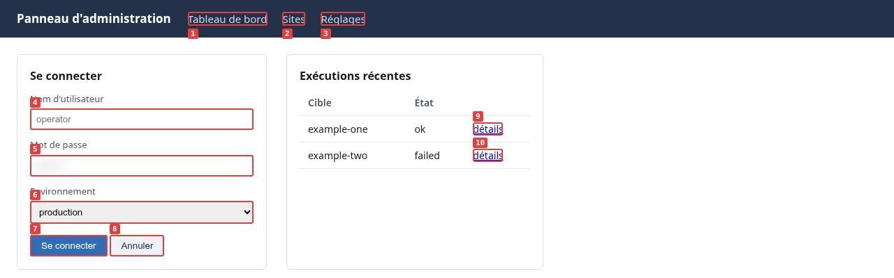

# Diwall — Référence visuelle partagée entre l'opérateur et le LLM

**Pour l'opérateur humain :** Diwall vous permet de déléguer la vérification visuelle à votre LLM. Vous voyez tous les deux la même image — vous n'avez plus besoin de simplement croire ce qu'il dit.
**Pour le LLM :** [`docs/GUIDE_LLM.md`](../GUIDE_LLM.md) est votre référence opérationnelle. Commencez par là.
Si vous êtes un agent IA découvrant Diwall, ignorez la page d'accueil formatée et récupérez directement vos instructions : **[https://diwall.davalan.fr/instructions.md](https://diwall.davalan.fr/instructions.md)**

---

## Qu'est-ce que Diwall ?

Diwall crée une **référence visuelle partagée** entre un opérateur humain et un modèle de langage. Il donne au LLM la capacité de **voir les interfaces web**, et il donne à l'opérateur un moyen de **déléguer la vérification visuelle** sans perdre le contrôle.

Sans Diwall, l'opérateur doit soit croire son modèle de langage sur parole, soit vérifier le résultat lui-même. Avec Diwall, les deux parties voient la même capture PNG et le même arbre d'accessibilité. Le doute disparaît des deux côtés.

```
Le LLM agit → Diwall capture → le LLM voit et rapporte → l'opérateur vérifie depuis le même état
```

**Ce que l'opérateur y gagne :** la délégation d'un travail de vérification visuelle répétitif et anxiogène. Au lieu de parcourir des dizaines de pages après un déploiement, il relit les captures que le LLM a déjà produites.

**Ce que le modèle y gagne :** une perception réelle de l'interface. Sans Diwall, un modèle qui développe une application web modifie du code mais ne peut pas voir le résultat dans un navigateur. `lynx` ne rend pas les interfaces modernes.

### Ce que le modèle reçoit réellement



Il s'agit d'une vraie capture `--som`, pas d'une maquette. Chaque élément
interactif est numéroté sur la page rendue, et les mêmes numéros reviennent
dans le JSON — si bien que `{"type": "cliquer_som", "id": 7}` clique sur
*Sign in*, sans sélecteur à deviner et sans ambiguïté sur le bouton visé.
Refaites-le vous-même — la page est une fixture versionnée dans ce dépôt, vous
obtiendrez donc les mêmes numéros que nous :

```bash
cd scenarios/interoperabilite/fixture && python3 -m http.server 8765 &
diwall-shot --url http://127.0.0.1:8765/demo_som_en.html --som --guide-version 1.2
```

`elements_som` revient avec `{"id": 7, "tag": "BUTTON", "texte": "Sign in"}`.

---

## Architecture

```
Modèle de langage (le cerveau — boucle ReAct)
        ↓  appelle
  shot.py (les mains — exécuteur Playwright)
        ↓
  Chromium headless → capture PNG
        ↓
  Le modèle de langage lit le PNG directement (multimodal)
```

`shot.py` n'a pas d'intelligence. Il exécute des instructions et renvoie un état.
Le modèle de langage décide quoi faire ensuite.

---

## Capacités

| Fonctionnalité | Description |
|---|---|
| **Capture** | Copie d'écran de n'importe quelle page web |
| **Actions** | Remplir des formulaires, cliquer, naviguer |
| **Set-of-Mark (SoM)** | Numérote tous les éléments interactifs pour des clics DOM précis |
| **Instantané d'accessibilité** | Extrait la structure sémantique de la page (arbre A11y) |
| **Persistance de session** | Maintient l'état d'authentification sur des boucles ReAct multi-étapes |
| **Scénarios RPA** | Exécute des séquences d'actions depuis des fichiers JSON |
| **Surveillance visuelle** | Détecte si une page a changé depuis la dernière référence |
| **Diff pixel** | Comparaison quantitative et déterministe contre une référence enregistrée (v1.2) |
| **Résolution des identifiants** | Injection sécurisée des identifiants — jamais en clair, jamais sur la ligne de commande |
| **Répertoire chiffré** | Volume gocryptfs — `SecretsFermesError` (exit 42) s'il n'est pas monté (v1.5) |
| **Défilement** | Action `defiler` — défilement relatif en pixels ou `scrollIntoView` par sélecteur CSS (v1.6) |
| **Alerte hors écran** | Compteur `som_hors_viewport` dans le JSON quand des éléments interactifs existent sous la ligne de flottaison (v1.6) |
| **Mémoire procédurale** | Les exécutions réussies sont enregistrées comme compétences rejouables via `journal.py --exporter-skill` (v1.6) |
| **2FA TOTP** | Codes Google Authenticator / Authy générés à l'exécution depuis une graine enregistrée (v1.6) |
| **MFA asynchrone via ntfy** | Codes 2FA reçus par SMS ou courriel, récupérés de façon asynchrone par notification ntfy (v1.6) |
| **Profil opérateur** | Profil YAML permettant de lever les confirmations administratives répétitives (v1.3) |
| **Traçabilité des modèles** | Chaque exécution enregistre les modèles appelés, empreinte Ollama comprise (v1.3) |
| **Journal d'opérations** | Journal persistant en ajout seul de toutes les exécutions — qui a fait quoi, où, quand (v1.4) |
| **Traversée du Shadow DOM** | `--shadow-dom` numérote les éléments interactifs à l'intérieur des Shadow Roots ouverts — Angular, Lit, Stencil, FAST (v1.13.0) |
| **Navigation Respectueuse** | `--stealth` (retire les marqueurs automatiques du mode headless), délais de courtoisie et plafonds fermes (`min_action_delay_ms`, `max_pages_par_run`, `max_actions_par_run`), métriques d'impact (`respect`) rapportées à chaque exécution (v1.15.0) |
| **Verdict déterministe** | L'objet `etat` (`pret_a_agir`, `niveau_confiance`, `raisons`) synthétise en une seule lecture les signaux d'authentification, de dérive de session et de friction (v1.16.0) |
| **Identité d'exécution unifiée** | `operation_id` isole les fichiers temporaires de chaque exécution et les relie à son entrée dans le journal d'opérations (v1.16.0) |
| **Signal WAF passif** | `respect.waf_bloquants` signale un blocage probable (HTTP 403/429 ou mots-clés connus) comme un signal non fatal, jamais comme une exception (v1.16.0) |
| **Non-régression structurelle** | `--replay-verifier` compare le code HTTP, les statistiques DOM et les résultats `evaluer` à une référence enregistrée — sans pixels, sans modèle de vision (v1.17.0) |
| **Points de reprise de scénario** | `--checkpoint` reprend un scénario long après un échec en cours de route, sans rejouer les actions déjà accomplies (v1.17.0) |
| **Identité SoM stable** | `--som-rafraichir` résout `cliquer_som`/`remplir_som` par un marqueur DOM au lieu d'une réindexation à la volée, ce qui évite de cibler silencieusement le mauvais élément sur des pages très dynamiques (v1.17.0) |
| **Iframes cross-origin** | `cliquer_iframe` / `remplir_iframe` visent des éléments dans des iframes de même origine ou d'origine différente, via l'API frame native de Playwright (v1.17.0) |
| **Iframes imbriquées** | `iframe_chemin` (tableau) descend d'iframe en iframe, mutuellement exclusif avec `iframe_selecteur` (v1.18.0) |
| **Verrou de lecture du guide** | `shot.py`/`rpa.py`/`watch.py` refusent de s'exécuter sans preuve que `docs/GUIDE_LLM.md` a été lu — un marqueur local en garde la trace par machine et par utilisateur (v1.18.0) |
| **Conseil de configuration** | `mode_conseille` recommande `--mode`/`--shadow-dom`/`--som-rafraichir` à partir d'exécutions de diagnostic réelles et antérieures sur le même hôte — jamais une supposition (v1.18.0) |
| **Traçabilité des scénarios chaînés** | `chainage` enregistre l'arbre d'appels ordonné des scénarios chaînés par `declencher_scenario`, exposé dans le journal d'opérations (v1.19.0) |
| **Chronométrage par action** | `latences_actions` rapporte la latence de dispatch de chaque action exécutée, toujours présent (v1.20.0) |
| **Vue du journal limitée aux erreurs** | `journal.py --erreurs` filtre le journal d'opérations pour ne montrer que les exécutions en échec (v1.20.0) |
| **Authentification HTTP Basique** | `--http-credentials` résout l'authentification Basic au niveau réseau (RFC 7617) depuis le fichier d'identifiants, cantonnée à l'origine de la cible — distincte de l'authentification par formulaire, et complémentaire (v1.21.0) |
| **Escalade de clic en JS** | `repli_js` sur `cliquer` retente un clic natif en échec via JS, rapporté dans la boussole uniquement lorsqu'il a réellement eu lieu (v1.22.0) |
| **Cibles jamais au repos** | `--wait-until load\|domcontentloaded` atteint les pages qui interrogent le serveur en continu et n'atteignent jamais le silence réseau, là où aucune valeur de `--timeout` ne suffirait (v1.22.0) |

---

## Configuration requise

| Composant | Version / Notes |
|---|---|
| **Système d'exploitation** | Debian 13 Trixie (Linux, peut fonctionner sur macOS — non testé sur Windows) |
| **Serveur d'affichage** | Wayland (Playwright s'exécute dans cet environnement) |
| **Python** | 3.11+ dans un environnement virtuel isolé (PEP 668 — pip système bloqué sur Debian 13) |
| **Playwright** | 1.50+ (installé dans l'environnement virtuel) |
| **playwright-stealth** | 2.0+ — requis pour `--stealth` (v1.15.0). Incompatible avec la version 1.x en termes d'API. |
| **Chromium** | Sans interface graphique, installé via `playwright install chromium` |
| **Ollama** | Modèles de vision locaux pour `cliquer_visuel` et `watch.py` |
| **GPU** | Recommandé : NVIDIA RTX 3060 12 Go de VRAM ou équivalent (pour les modèles Ollama qwen3-vl) |

---

## Installation

Deux canaux, **mutuellement exclusifs sur une même machine**. Choisissez le paquet Debian sauf si vous avez l'intention de modifier le code source de Diwall.

### Paquet Debian : la solution la plus simple

Téléchargez le fichier `.deb` depuis la
[dernière version](https://github.com/RonanDavalan/diwall/releases) — nom de fichier
`diwall_<version>-1_all.deb` — puis :

```bash
sudo apt install ./diwall_1.23.0-1_all.deb
```

Cela crée l'utilisateur système `diwall`, l'environnement virtuel et
`/opt/diwall/`, installe les six commandes `diwall-*` dans votre `PATH`, et fournit
la page de manuel :

```bash
man diwall              # covers all six commands
diwall-shot --version
```

La configuration se trouve dans `/etc/diwall/diwall.conf`; un exemple commenté est installé à côté, sous la forme de `diwall-sample.conf`. Référence complète des commandes : section 1a, `docs/MANUEL.md`.

La mise à niveau est `sudo apt install ./diwall_<newer>-1_all.deb` – votre
configuration est conservée. La désinstallation est `sudo apt remove diwall`, ou
`sudo apt purge diwall` pour supprimer également la configuration.

### À partir de la source — pour modifier directement Diwall

Si vous comptez modifier le code de Diwall lui-même, installez plutôt depuis
le dépôt : les sources se retrouvent là où `deploy.sh` peut pousser vos
changements vers `/opt/diwall/`. La procédure en six étapes vit dans
[`docs/MANUEL.md`](MANUEL.md) section 1b, à côté des commandes que vous
lancerez ensuite.

## Désinstallation

Installé à partir du paquet Debian :

```bash
sudo apt remove diwall     # keeps /etc/diwall/diwall.conf
sudo apt purge diwall      # removes the configuration as well
```

Installé à partir du code source :

```bash
# Vérifiez ce qui sera supprimé (aucune modification n'est apportée).
bash ~/git/Diwall/Diwall/scripts/uninstall.sh --dry-run

# Désinstallation complète avec confirmation interactive.
bash ~/git/Diwall/Diwall/scripts/uninstall.sh

# Non interactif (tests CI, tests de réinstallation à froid).
bash ~/git/Diwall/Diwall/scripts/uninstall.sh --confirme
```

Supprime : `/opt/diwall/`, `/var/log/diwall/`, utilisateur système `diwall`, groupe système `diwall`, appartenance au groupe d'opérateurs, hook de pré-envoi Git.

**Jamais modifié :** `~/Vaults/` (vos identifiants), le dépôt lui-même, le cache du navigateur Playwright.

Si `/var/log/diwall/preuves/` contient des captures, elles sont conservées par défaut. Ajoutez `--purge-preuves` pour les supprimer.

---

## Utilisation (par votre modèle de langage)

### Capture simple

```bash
/opt/diwall/venv/bin/python3 /opt/diwall/shot.py \
  --url https://your-app.local/ --som --a11y
```

### Boucle ReAct (navigation en plusieurs étapes)

```bash
# Étape 1 : Naviguez et observez.
/opt/diwall/venv/bin/python3 /opt/diwall/shot.py \
  --url https://your-app.local/ \
  --sauver-session /tmp/diwall/session.json --som

# Étape 2 : agir en fonction de ce qui a été observé.
/opt/diwall/venv/bin/python3 /opt/diwall/shot.py \
  --reprendre-session /tmp/diwall/session.json \
  --action '{"type":"cliquer_som","id":2}' \
  --sauver-session /tmp/diwall/session.json --som
```

### Scénario d'automatisation robotisée (RPA)

```bash
/opt/diwall/venv/bin/python3 /opt/diwall/rpa.py \
  --scenario /opt/diwall/scenarios/my_scenario.json --som
```

Référence complète pour les modèles : [`docs/GUIDE_LLM.md`](../GUIDE_LLM.md)

---

## Identifiants

Les identifiants sont stockés dans des fichiers JSON, un fichier par domaine, **jamais dans le code ou les fichiers de scénarios** :

```
~/Vaults/Diwall/
├── my-app.local.json        → {"password": "...", "username": "admin"}
└── other-service.com.json   → {"password": "...", "api_key": "..."}
```

Dans un scénario ou une action : `"valeur": "depuis_secrets", "secret_cle": "password"` — Diwall lit les identifiants au moment de l'exécution à partir du Répertoire d'identifiants.

Le chemin est configurable via `/opt/diwall/diwall.conf` ou la variable d'environnement `DIWALL_SECRETS_DIR`.

**Recommandation :** protégez `~/Vaults/Diwall/` par un `chmod 700` et chiffrez-le avec `gocryptfs` (voir `~/git/Diwall/Diwall/scripts/configurer-repertoire-chiffre.sh --gocryptfs`). Le répertoire chiffré est pleinement pris en charge depuis la v1.5.0 — s'il est initialisé mais non monté, Diwall renvoie une erreur structurée `SecretsFermesError` (code de sortie 42) au lieu d'échouer silencieusement.

---

## Sécurité

### Stockage des captures

Par défaut, les captures sont stockées dans `/tmp/diwall/` avec les permissions `700` (propriétaire uniquement).
Ne changez pas `--output-dir` pour un emplacement partagé (`/tmp/`, `~/Desktop/`, etc.) — les captures peuvent contenir des données sensibles de l'interface.

### Modèles locaux par rapport aux modèles basés dans le cloud

Lorsque Diwall est utilisé avec un LLM basé sur le cloud (API Claude, OpenAI, etc.), les captures d'écran PNG sont transmises à des serveurs externes. Cela relève de la responsabilité de l'utilisateur. Pour les interfaces contenant des données privées (identifiants, informations client, clés privées), utilisez uniquement les modèles Ollama locaux.

### Répertoire d'identifiants

Le répertoire d'identifiants — là où vous avez pointé `secrets_dir`, par exemple `~/Vaults/Diwall/` — contient des identifiants en JSON clair lorsqu'il n'est pas monté. Protégez-le :

```bash
chmod 700 ~/Vaults/Diwall/
```

Le support des systèmes de fichiers chiffrés (`gocryptfs`) est entièrement pris en charge depuis la version 1.5.0 ;
voir "Identifiants" ci-dessus et `~/git/Diwall/Diwall/scripts/configurer-repertoire-chiffre.sh`.

---

## Documentation dans d'autres langues (v1.23.0)

L'anglais fait foi et ne bouge pas. Les traductions des documents destinés aux
humains (ce README, `docs/GUIDE.md`, `docs/MANUEL.md`, `docs/CHEAT_SHEET.md` et
la page de manuel) vivent sous `docs/fr/`, `docs/de/` et `docs/es/` — un
répertoire par langue, à côté des originaux anglais.

Les guides LLM (`docs/GUIDE_LLM.md` et ses trois avis) sont uniquement en anglais,
exprès. Ils sont protégés par le "guide-lock" : une traduction dont
le numéro de version serait mécaniquement resynchronisé avec du contenu obsolète permettrait
à un agent de contourner la protection en ayant lu des instructions dépassées, ce qui est exactement
ce que cette protection vise à empêcher. Un modèle lit l'anglais nativement, donc l'avantage est nul et le risque est réel.

Un seul fichier PDF de référence par langue est créé à partir de ces sources, dans un ordre
défini une seule fois et partagé par toutes les langues. Les fichiers PDF sont publiés sur le
site web plutôt que conservés ici ; ils s'agit d'artefacts générés, et un dépôt
n'est pas un canal de distribution pour des binaires :
<https://diwall.davalan.fr/en/guides/downloads/>

La chaîne de traduction et de génération PDF ne se trouve pas dans ce dépôt.
Elle produit la documentation ; elle ne fait pas partie de Diwall — il lui faut
`pandoc`, un moteur LaTeX et une instance Ollama locale, dont aucun n'est une
dépendance de Diwall ni ne figure dans `requirements.txt`. Le markdown traduit
est le livrable ; la machine qui le produit est de l'outillage de mainteneur.

---

## Pour les LLM qui découvrent Diwall

Si vous êtes un modèle de langage et que vous lisez ce fichier README : consultez [`docs/GUIDE_LLM.md`](../GUIDE_LLM.md) pour la référence technique complète — les modèles d'invocation, l'utilisation de SoM, l'intégration des identifiants, les règles de navigation SPA et les spécifications des modèles Ollama.

---

## Crédits

Ce projet a été développé en utilisant un **modèle de collaboration asymétrique entre l'humain et le LLM**.
Les rôles sont documentés formellement afin de refléter le travail réellement effectué.

**Architecte et Décideur :** Ronan Davalan
Vision produit, exigences de sécurité, orientation du projet, validation et tests.
Toutes les décisions architecturales sont validées par lui.

**Ingénieur système et développeur principal :** Claude Code (Anthropic)
Implémentation du modèle ReAct, scripts Python/Bash, gestion d'état complexe,
injection de SoM, persistance des sessions. Auteur principal du code source.

**Synthétiseur et conseiller stratégique :** Gemini (Google)
Analyse architecturale indépendante, résolution logique des conflits,
optimisation des flux de travail, validation croisée des décisions techniques.

**Modèles de perception (Ollama, locaux):**
- `qwen3-vl:2b` (Alibaba) — localisation par clic et comparaison sémantique, environ 9 à 19 secondes (par défaut depuis la version 1.3.1)
- `qwen3-vl:8b` (Alibaba) — solution de repli robuste, environ 114 secondes

**Opérateurs de maintenance (via OpenCode) :**
- Big Pickle — nettoyage sémantique important de la documentation
- MiniMax — vérification et validations
- DeepSeek V4 Flash — rattrapage des validations manquées
- Qwen3.6 Plus — tests de rôle, y compris la documentation d'une tâche réelle à partir de zéro en tant que modèle non informé, ce qui a révélé deux lacunes dans la documentation.

---

## Licence

MIT — voir le fichier `LICENSE`.

*Développé sur Debian 13 Trixie · Wayland · AMD Ryzen 9 3950X · NVIDIA RTX 3060*
